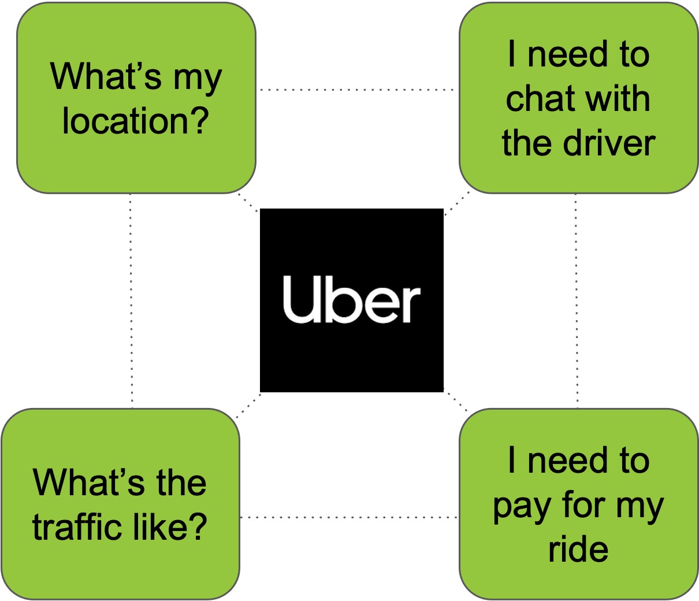
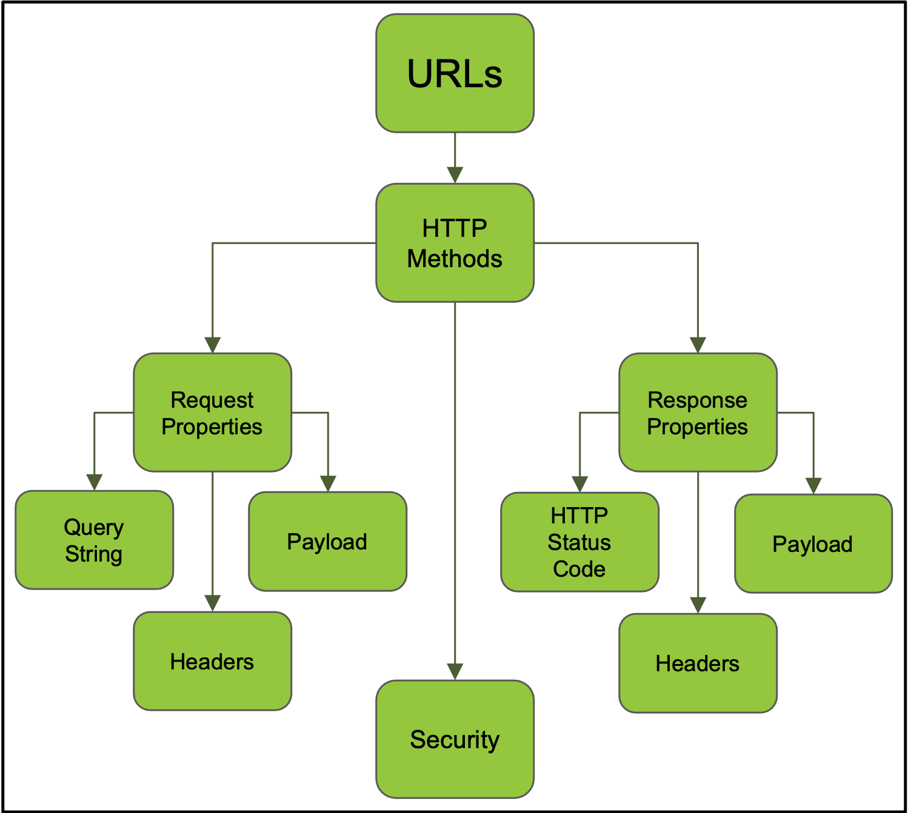

# Introducing OpenAPI

## Introduction

### Chapter Overview

Many aspects of our daily lives that we oftentimes take for granted are powered by APIs. Our digital world is enabled by the API Economy, an increasingly vast collection of products and services that have one thing in common, namely that their presence in the market is facilitated by providing an API. Whilst many of these APIs can be accessed for free, an increasing number are paid-for offerings. Organizations that pay for access APIs need an effective means to understand them. Describing the APIs that power these products and services in a manner that is both efficient and scalable is therefore crucially important for API providers. This need spawned the birth of API description languages.

API description languages have grown alongside the API Economy. They provide the means to describe and document the shape of an API. Whilst many exist, the OpenAPI Specification has become the most popular and widely used. It allows API providers to create OpenAPI descriptions that power an ecosystem of tools that help API providers and API consumers to publish and consume APIs.

### Learning Objectives

By the end of this chapter you should understand:

- What the API Economy is.
- Why API description languages have become important.
- What OpenAPI is and why it is important.

## Introducing the API Economy

### The role of APIs

Software has been eating the world for over a decade. If this feast is still going on then Application Programming Interfaces, or APIs, are the utensils we make the meal with and the cutlery we use to devour it. APIs are fundamental to how we do business across many different industries and are a building block in so many other technology trends including crypto, open banking and AI.

Leveraging APIs has allowed businesses to forge new products and operating models and provide the means to expose them in a way that could only have been dreamed of 30 years ago. They have enabled the general interconnectedness of products and experiences. Many products we take for granted - think Uber and the communication between you, the driver, Uber itself, and where you are in the world - would not exist without the coming together of multiple APIs to locate you, enable messaging between you and the driver and allow you to make payment. Uber leverages partners in the API ecosystem to provide these features of their ride-hailing offering. They do not build the services to deliver these features of your experience with them, even though that option is open to them.

Uber uses products already in the market, accessed via an API, and integrated into their own applications. This means they can offer these features using tried-and-tested providers without the build overhead, in either time, cost, or quality.

### APIs-as-Products

The APIs-as-products view of the world - and the associated revenues being generated by businesses providing APIs - now dominates the world of APIs. The evolution of the market is astonishing in that - at their heart - APIs are a type of software interface that performs the same role as it has since the dawn of computing, namely the invocation of services and exchange of data.

This growth of business models based on APIs is why we hear the phrase the API economy. The API economy is a catchall term that describes the businesses bringing their products to market either partially or wholly using APIs. It is impossible to put a dollar value on the API economy because so many businesses take part.

Being an API provider has become almost fundamental to doing business across so many industries and verticals. This growth continues to expand as industries evolve “open” models - often prompted through regulation - that have APIs as a fundamental building block.

The growth in the API economy has largely been organic and has taken over a decade. This organic growth has resulted in challenges for product and technology teams providing APIs to public audiences over the internet, in many cases for the first time in a given industry. Meeting these challenges is not just a question of solving technical problems: They are fundamental to doing business in an API-enabled economy.

One of the most fundamental challenges is also one of the most simple: How can we describe our APIs in a way that allows external developers to create software clients and also understand the APIs operations and functionality?

API description languages help meet this challenge.

## Describing APIs

### Describing Software Interfaces

Providing an accurate description of a software interface is not a unique problem. Different styles of software integration have been developed over the years that use a description language to describe their functionality. Different programming languages and software providers use interface description languages (IDL) as a feature of providing appropriate documentation.

The most obvious example that was popular at around the time the API Economy started to grow is the Web Services Description Language (WSDL). This is used in software-oriented architectures (SOA) and is very much a technical description that provides the information required to engineer a software client to call a given operation. These documents are, however, geared towards a specific technology stack and architectural style, largely due to the software vendors involved in the SOA world.

The growth of the API Economy - being organic in nature - has been much more distributed. The protagonists have also favored the technologies and toolsets they are familiar with and that can be used without specific libraries or software development kits. For example, HTTP is at the core of what are commonly called web APIs because it underpins the Internet, provides an obvious transport mechanism and has a freely available client in the vast majority of programming languages and platforms. This has been bolstered by the adoption of Representational State Transfer, or REST, as the salient architectural style of API, which is built on top of HTTP.

However, there was a missing piece of the puzzle, namely a means to accurately describe the operations, parameters and payloads that a given API supported. Whilst REST espoused the use of hypermedia to drive discovery and context in consuming web APIs, many API providers and consumers required something that encapsulated the description of an API using a concise mechanism.

This need resulted in the birth of API description languages.

### What are API description languages?

There has been a need to communicate what an API looks like from the early days of the API Economy. The coalescing of providers around HTTP semantics and REST to provide their APIs also solidified what needed to be communicated and how it might be formatted. API description languages therefore came into being that provide a document format for expressing the shape of an API. They focus on providing information about the construct of a given API and the properties most important to those who need to understand them, encoded in a format that is both machine- and human-readable such as JSON or YAML.

The properties of the APIs they describe include the following:

- The URLs - often termed endpoints - that the API exposes.
- The HTTP methods supported at each endpoint, loosely termed an operation.
- The parameters expected by each operation including HTTP headers, query parameters and where supported by the HTTP method the request body.
- The expected HTTP responses codes.
- The expected response headers for each response code and, where supported, the response body.

In the case of request and response bodies there is the added complexity of describing the data in a schematic way. In the case of the growth of the API Economy this has meant seeking an effective means to describe JSON data as it is the most typical content type supported by API providers, again due to the preferences of the API implementers.

Accurately describing the properties of an API has become and continues to be critical to the success of any API provider. One might ask why API providers do not just take a shortcut and share their source code - or the most meaningful portion that describes their interfaces - with external developers to help them understand their APIs. The key point here is that such a practice would make life difficult for developers that do not speak the language. What was and continues to be needed is a vendor-neutral specification, agnostic of any programming language that makes for simplicity in describing the capabilities of an API.

### What does an API description language solve for?

Communicating accurately with a developer audience is at the heart of what an API description language provides.

These languages are intended to provide two things:

- A document that can help a human being understand a given API through a structure that is aligned to how APIs work with descriptions that can help clarify the operation.
- A specification that can be consumed by tooling to assist in specific tasks, for example, to generate a client that consumes an API, generate a server that implements an API, provide differences between 2 versions of the same API, and so on.

Establishing a common vernacular shared between API providers and API consumers is critical to the success of any API programme. API description languages therefore aim to provide this to developer communities.

### What API description languages are there?

A number of description languages exist alongside OpenAPI. Examples include [RAML](https://raml.org/), [API Blueprint](https://apiblueprint.org/), and Swagger with the "Specification Wars" seeing each format competing to become the most widespread. Each follows a similar mechanism of using a structured and human-readable notation language like JSON or YAML coupled with an object specification and descriptions formatted in Markdown to provide a complete representation of the structure of an API.

In the context of this course Swagger is the most pertinent API description language. Swagger was originally created by SmartBear Software and was used in both their product and open source tools to define API specifications across the API Economy.

Swagger was donated by SmartBear in 2015 to the OpenAPI Initiative and forms the basis of the OpenAPI Specification, which is arguably the most prevalent API description language in use today.

## An Overview of OpenAPI

### What is OpenAPI?

The OpenAPI Specification is a language that enables the transfer of knowledge from API providers to API consumers. It is an open standard for describing your APIs, allowing you to provide an API description encoded in a JSON or YAML document. Like all description languages it provides a comprehensive dictionary of terms that reflects commonly-understood concepts in the world of APIs, embedding the fundamentals of HTTP and JSON as we’ve already discussed. When teamed up with supporting tools it can provide a rich experience based on a simple document.

The OpenAPI Specification is looked after by the OpenAPI Initiative, a consortium that shepherds the development of the Specification. Organizations in the industry can apply for [membership](https://www.openapis.org/membership/members) in order to participate in the development of the standard. The Initiative has an open governance structure under the Linux Foundation and is focused on creating, evolving and promoting a vendor-neutral and programming-language agnostic description format. The development of the standard is led by the Technical Steering Committee who evaluate and ultimately author changes to the specification.

Vendor neutrality is the cornerstone of what the OpenAPI Initiative is about. The Specification is geared towards being used by any software or API provider, tooling maker, in fact anyone who needs to describe their API with the widest possible reach.

This makes OpenAPI a fundamental building block for the API Economy. As we’ve discussed, other description languages exist but all serve as an essential communication tool. Given its primacy, OpenAPI therefore leads the way in evolving the discourse between API providers and API consumers and providing a common vocabulary for all who take part.

### Other OpenAPI Initiative Specifications

The development of the standard is at the forefront of the efforts of the OpenAPI Initiative. There are, however, other members of the OpenAPI community who overlay the specification with standards for specific industries and verticals. One of the most important amongst these are Special Interest Groups (SIGs).

SIGs play a valuable role within the OpenAPI ecosystem by focusing on specific areas or topics related to the specification. These groups are composed of individuals or organizations with a shared interest in advancing and addressing particular aspects of the specification. They focus expertise around a given problem, validate use cases, solve challenges and help develop suitable standards as an output of their activities.

The [Workflows SIG](https://github.com/OAI/sig-workflows) is an example of such an effort where a group has taken a specific problem and looked to define a standardized outcome. This SIG has created a description language with the working title of Workflows that overlays OpenAPI and is engineered for defining an operation that requires calling more than one API. It provides the means to define common parameters between those APIs, mapping them together in an end-to-end description of what needs to be executed to complete a given operation or business flow.

Workflows gives an example of the role of OpenAPI as a building block in the API Economy. The interconnectedness of platforms and the use of software-as-a-service means that API consumers need to knit together services and data from several API calls across one-or-more API providers. Workflows builds on top of the rich information OpenAPI delivers: Without it Workflows could not function as it would lack the context to successfully make API calls and interpret results.

We'll go into more detail on the Workflows Specification in Chapter 5.

## Knowledge Check

Congratulations on completing Chapter 1 - Introducing OpenAPI. Take this quiz to check your understanding of the concepts you've learned about so far.

### Question 1

What protocol is a core building block of the OpenAPI Specification?

- [ ] SMTP
- [ ] DNS
- [ ] POP
- [x] HTTP

### Question 2

Which of the following does an API description language typically **_NOT_** attempt to describe?

- [ ] URLs
- [ ] Request bodies
- [x] MAC Addresses
- [ ] HTTP response codes

### Question 3

What does the abbreviation REST stand for?

- [x] Representational state transfer
- [ ] Restricted state transfer
- [ ] Resource state transfer
- [ ] Requested state transfer

### Question 4

What was the OpenAPI Specification formally known as?

- [ ] I/O Docs
- [x] Swagger
- [ ] RAML
- [ ] API Blueprint

### Question 5

Which of the following is **_NOT_** a description language developed during the growth of the API economy?

- [ ] RAML
- [ ] API Blueprint
- [ ] OpenAPI
- [x] Web Services Description Language

### Question 6

Who is directly responsible for the development of the OpenAPI Specification?

- [x] OpenAPI Initiative
- [ ] Linux Foundation
- [ ] SmartBear
- [ ] Google

### Question 7

In what year was Swagger donated to the OpenAPI Initiative?

- [ ] 2010
- [ ] 2012
- [x] 2015
- [ ] 2021

### Question 8

What is considered to be the cornerstone of the OpenAPI Specification?

- [ ] Adherence to HTTP
- [ ] Use of JSON Schema
- [ ] Extensibility
- [x] Vendor-neutrality

### Question 9

Which organization provides the governance structure for the OpenAPI Initiative?

- [ ] Open Source Initiative
- [ ] Mozilla Foundation
- [ ] Apache Software Foundation
- [x] Linux Foundation

### Question 10

What does the abbreviation SIG stand for?

- [ ] Standardized Internet Grading
- [ ] Special Internet Group
- [x] Special Interest Group
- [ ] Significant Interest Group
