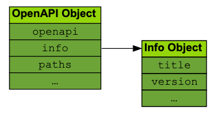
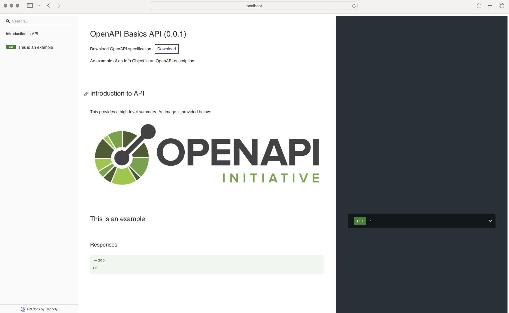
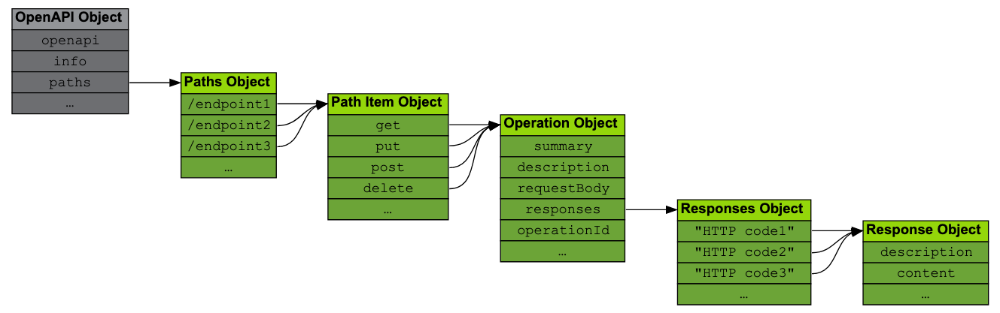
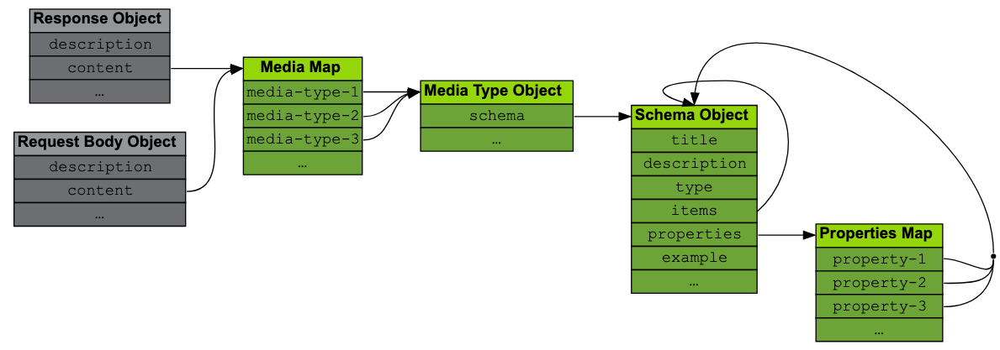
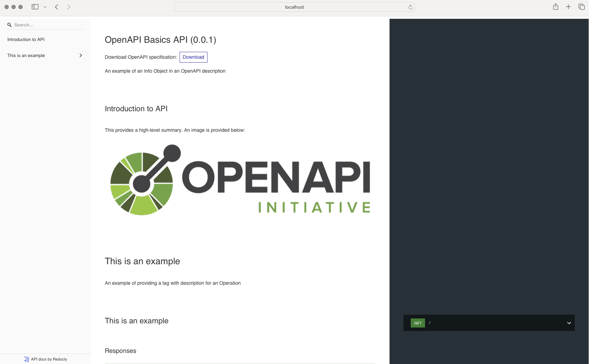
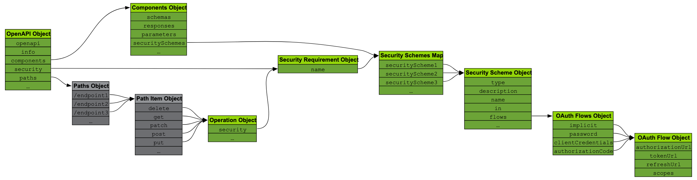

# OpenAPI Basics

## Introduction

### Chapter Overview

The OpenAPI Specification provides a consistent language to describe the shape of an API, providing a bridge between the expression of an API in code and the HTTP-based services it represents.

Understanding this structure and the syntax of the OpenAPI Specification is critical to using it effectively as a tool to communicate with API consumers and tooling for the API lifecycle.

### Learning Objectives

By the end of this chapter, you should be able to:

- Explain the basics of the HTTP-based APIs.

- Describe how OpenAPI maps the features of HTTP-based APIs to its description language.

- Identify the features OpenAPI provides that reflect the needs of API consumers.

- Explain the basic structure of an OpenAPI description and why this structure provides an effective means of communication.

## HTTP, APIs, and OpenAPI

### The Role of HTTP

In the previous chapter we discussed the growth of the API space and how this growth has been driven by an increasing number of APIs that are built on the Hypertext Transfer Protocol (HTTP), which is the protocol that web servers and browsers use to communicate. There's no surprise that HTTP is the go-to choice as the protocol for providing APIs. HTTP is the "language" of the web and providing APIs over the Internet using its most widely used application protocol is the easiest choice for getting these products and services to target audiences quickly, effectively, and with minimal "plumbing" outside of the API providers stack. HTTP-based APIs routinely implement the JavaScript Object Notation (JSON) as the means to encode request and response payloads. These conventions have grown organically and reflect the preferences of both providers and consumers of web APIs.

OpenAPI is, therefore, primarily a means to describe HTTP-based APIs that largely, but not exclusively, provide JSON payloads. It does this by mapping the semantics of HTTP, either natively or in the [REST architectural style described by Roy Fielding](https://ics.uci.edu/~fielding/pubs/dissertation/rest_arch_style.htm). Of course, there are other features implemented in OpenAPI that provide useful features for API providers to accurately describe their APIs.

### Mapping OpenAPI to HTTP

If you consider OpenAPI in terms of how it maps to HTTP, it can be qualified as follows:

- **Uniform Resource Locators**: HTTP is based on a system of [Uniform Resource Locators](https://datatracker.ietf.org/doc/html/rfc1738) (URLs). URLs incorporate a given domain name or IP address and the path at the server the resource is hosted at to provide a unique reference to a resource or entity. In OpenAPI this is represented by a **Path**, which is defined using a **Paths Object** and contains one or more **Path Item Objects**.

- **Operation Object:** HTTP provides request methods that can be used to retrieve or change the state of a given resource or entity - GET, POST, PUT, and so on. Therefore a Path Item Object implements an **Operation Object** that describes how an HTTP method is supported in the API.

- **Parameters Object:** Each Operation Object references an array of **Parameters Objects** that reflect the different types of parameters an HTTP URL can support - query parameters, HTTP header fields that form the HTTP header, and cookies. OpenAPI also extends this to define **Path** parameters that describe a placeholder for a fragment of the URL that can be replaced by the API consumer (more on this later).

- **Request Body Object:** Some HTTP methods (most notably POST) support sending a message payload to the server, which can be acted on to create a resource or execute a given operation. In OpenAPI this maps onto a **Request Body Object**.

- **Responses Object:** HTTP defines a large number of possible response [status codes](https://tools.ietf.org/html/rfc7231#section-6), each providing a predefined coarse-grained indicator of the success or failure of the requested operation. The Operations Object provides a **Responses Object** that describes the status codes defined by the API and their associated properties.

- **Response Object:** The Responses Object references one or more **Response Objects** that describe the response payloads. Each response is qualified by the content type, with HTTP headers described as required.

These mappings demonstrate the strong association between HTTP and OpenAPI and the basis of the model underpinning the OpenAPI language. While there are protocols overlaying HTTP that are more difficult to map - for example, representing WebSockets in a way that is not overly complex - the close alignment with HTTP means that OpenAPI can cover a wide range of design choices.

OpenAPI also uses several supporting technologies to underpin the Specification:

- **JSON and YAML**: An OpenAPI description document is a JSON object that can be serialized in either JSON or YAML (both are supported as first-class citizens).

- **JSON Schema**: JSON Schema is used to provide the means to define the properties of an object - defined as a [**Schema Object**](https://spec.openapis.org/oas/v3.1.1#schema-object) in OpenAPI. A Schema Object is used to describe the format of request and response payloads, parameters, and headers.

- **Markdown**: [CommonMark](https://commonmark.org/) (a specific dialect of markdown) provides the syntax for adding descriptive text to an OpenAPI description document intended for human beings to read.

These features provide the basis of both the syntax and structure for creating a usable API description document. The specification language itself, however, is the key to providing what API providers need to describe their APIs effectively. We'll walk through each object in turn and discuss its relevance to accurately describing an API.

### Versions of OpenAPI

Before breaking down the structure of OpenAPI it is important to highlight the versions of the Specification currently available:

- Swagger (in its version Swagger 2.0) was retrospectively labeled OpenAPI 2.0 after it was donated by SmartBear in 2015.

- OpenAPI 2.0 became the baseline for 3.0, which was published in 2017.

- The latest version, [OpenAPI Specification v3.1.1](https://spec.openapis.org/oas/v3.1.1.html), was published in October 2024.

Throughout the course, wherever we refer to OpenAPI we mean version 3.1.1. All versions up to 3.1.1, however, mirror the features of HTTP as described above. If you are using a version earlier than 3.1.1 the object definitions may differ slightly, but the relationship to HTTP remains largely the same.

## High-Level Structure

### Structure Overview

An OpenAPI description is a document following the rules of the OpenAPI Specification. It has a standard structure with each part designed to describe a part of the API. Several objects are provided at the root of the description document. The [OpenAPI Object](https://spec.openapis.org/oas/v3.1.1.html#openapi-object) describes the root of the document and references several objects that include:

- **Info Object**: Provides high-level information about the API being described.

- **Paths Object**: Describes the operations the API provides.

- **Components Object**: The object that houses all reusable objects within a given OpenAPI description (more on this later).

For the majority of users, these objects reference the most frequently used objects in OpenAPI. We'll look at each of these in more detail as we progress through the chapter.

### Providing Information through the Info Object

It's no surprise that providing overview information to end users of an API description document is served by the [**Info Object**](https://spec.openapis.org/oas/v3.1.1.html#info-object). It provides the means to describe high-level information including the title, summary, and description information that applies to the entire API and other usage aspects, such as the license and the terms of service.

The Info Object also provides a **version property**, which allows API providers to label a given document with a version number, often using [Semantic Versioning](https://semver.org/). This feature of OpenAPI is important as it provides a standardized location for an unequivocal "stamp" that allies a given OpenAPI description to the operations, behaviors, and data that an API consumer will expect to find at a provider's API:



###

### Examples of the Info Object

The Info Object is also notable as the description property supports the means to add extended additional information using Markdown. The code snippet below shows a minimal example of an Info Object:

```yaml
info:
  title: OpenAPI Basics API
  description: An example of an Info Object in an OpenAPI description
  version: 0.0.1
```

We can very quickly extend the example description over multiple lines and implement other Markdown features such as tables and an image:

```yaml
info:
  title: OpenAPI Basics API
  description: |
    An example of an Info Object in an OpenAPI description

    ## Introduction to API

    This provides a high-level summary. An image is provided below:

    

    These are the services levels available:

    | Name | Description |
    | --- | --- |
    | Basic | Free tier available to all consumers |
  version: 0.0.1
```

The important point here is that tooling can then render this information in a human-friendly format. The screenshot below uses [Redoc](https://github.com/Redocly/redoc) as an example:



The Info Object provides the means to extend the headline information that an OpenAPI description can deliver. This feature provides considerable capabilities for API providers to use OpenAPI as the spine of their documentation, pulling together both human- and machine-oriented information into a single format. Many API providers use this feature to considerable effect, which we'll look at in more detail in a later chapter.

## Describing API Shape

### URLs, Paths, and Methods

The most significant section in an OpenAPI description is the [**Paths Object**](https://spec.openapis.org/oas/v3.1.1.html#paths-object). The Paths Object is the key resource for API consumers because it associates a given URL and HTTP method to one or more Operations.

Take this snippet of the classic Petstore API as an example:

```yaml
/pets/{petId}:
  get:
    summary: Info for a specific pet
    operationId: showPetById
    tags:
      - pets
    parameters:
      - name: petId
        in: path
        required: true
        description: The id of the pet to retrieve
        schema:
          type: string
    responses:
      "200":
        description: Expected response to a valid request
        content:
          application/json:
            schema:
              $ref: "#/components/schemas/Pet"
      default:
        description: unexpected error
        content:
          application/json:
            schema:
              $ref: "#/components/schemas/Error"
```

We can explain these features as follows:

- Paths is a Map that uses a URL to identify a given [Path Item Object](https://spec.openapis.org/oas/v3.1.1.html#path-item-object). In the code snippet above, the URL **/pets/{petId}** is identified, which a Client must call to invoke one of the supported methods (note that fragments of the URL in this example are placeholders - Path Templates - for parameter values, which we'll discuss later).

- Each Path Item Object has one or more [Operation Objects](https://spec.openapis.org/oas/v3.1.1.html#operation-object). These provide the HTTP request methods that are supported at the URL. Each Operation can be uniquely identified in a given OpenAPI description with the property **operationId**.

- Each Operation, as well as identifying the supported HTTP request methods, provides summary and description information and tags.

- The Operations reference one or more parameters expressed as a [Parameter Object](https://spec.openapis.org/oas/v3.1.1.html#parameter-object) and optionally a [Request Body Object](https://spec.openapis.org/oas/latest.html#request-body-object) for HTTP request methods that support sending a request payload.

- Operations also implement a [Responses Objects](https://spec.openapis.org/oas/v3.1.1.html#response-object) , which defines a map of possible HTTP return codes implemented by the Operation that may reference a Response Object. A **default** option can be provided as a catchall, as shown in the code snippet.

### Relationship Between Paths, Path Items and Operations

Paths, Path Items, and Operations provide the binding between the URLs that are exposed, the methods supported at each URL, and the shape of the requests and responses for each operation.

The model below shows how these objects relate to each other:



It's worth noting that at version 3.1 of OpenAPI a Path Item Object can be reused directly, which means that a given combination of URL, method, parameter, and request/response body can be defined in the **pathItems** property in the Components Object. There are instances where reusing the Path Item Object might be desirable. For example, an organization may choose to template their definition for a health-check endpoint across all APIs and resolve them to a given Path Item Object to the correct definition. This feature has considerable power for creating organization-wide templates for reuse, and is discussed in more detail later.

## Describing Parameters, Requests, and Responses

### Providing Parameters

URLs, Paths, and Methods are, however, only part of how API providers typically define the operations supported by their API. Parameters (of different kinds) are critical to allowing API consumers to invoke a given operation with the correct arguments. In HTTP terms, we generally understand that parameters are represented in a [Query](https://datatracker.ietf.org/doc/html/rfc3986#section-3.4), with parameters passed that can influence the retrieval of information from the URL in question. As you may know from HTML, queries can come in different forms and encode the query parameters either in the URL or in the request body.

In OpenAPI the idea of parameters is extended to incorporate other means to pass information when invoking an operation through the [Parameter Object](https://spec.openapis.org/oas/v3.1.1.html#parameter-object). The OpenAPI Specification specifies four types of parameters:

- **Path**: A part of the URL, denoted using a template expression syntax in the Path Item Map. The specification provides the example **/items/{itemId}**, with the previous Petstore example being defined as **/pets/{petId}**. In practical terms what this means for an API consumer is that this value can be replaced with a resource identifier that addresses a specific resource. In our example, the consumer is retrieving information for a given item or pet.

- **Query**: Query Parameters reflect the Query string as previously mentioned. API providers often specify query parameters as optional arguments that can be used to modify the behaviors of a given operation. An oft-quoted example is for filtering a collection of resources when addressing a collection like **/pets**. An API provider might allow retrieval of all Pets, but provide the query parameter **petType** so that API consumers can retrieve pets of a given type - Cat, Dog, etc. There are a myriad of variations on this theme.

- **Header**: Header parameters are [HTTP header fields](https://httpwg.org/specs/rfc7230.html#header.fields), which specifically represent request parameters in this context. Header fields can also be defined [elsewhere](https://spec.openapis.org/oas/v3.1.1.html#header-object) and be referenced in an [Encoding Object](https://spec.openapis.org/oas/v3.1.1.html#encoding-object).

- **Cookie**: Cookies are also supported, allowing cookie data to be specified as a parameter.

A Parameter Object provides a common construct to define the attributes of the parameter in question. Take the Petstore example we presented earlier, and the parameter **petId**:

```yaml
name: petId
in: path
required: true
description: The id of the pet to retrieve
schema:
  type: string
```

The **petId** parameter is specified as a Path parameter. It includes a description property, whether the parameter is mandatory, and is declared with a type definition using a Schema Object that specifies the data type of the parameter. API consumers can therefore easily understand and implement parameter handling for the APIs they consume.

### Using OpenAPI to Describe API Requests and Responses

Request Body and Response Objects are critical to conveying one of the most important features of OpenAPI: what does the data look like? Having the means to describe the properties of a payload for a given operation is critical to successfully communicating what an API consumer needs to know. OpenAPI would be a much less powerful tool if this aspect of the description language did not exist.

All Request Body and Response Objects provide a description of how the data is encoded, which is done using a Media Type Object. In the examples you've seen so far, the format of the request or response payload can be defined with a property like **application/json**. This value will provide the value of the **Content-type** header at runtime.



### Representing Data Using a Schema Object

The Media Type Object includes the property **schema**, which defines or references a Schema Object. We mentioned the fact that OpenAPI outsourced the semantics of defining a Schema Object to JSON Schema in our introduction, with each specification referencing a different JSON Schema version. [Draft 2020-12](https://tools.ietf.org/html/draft-bhutton-json-schema-00) is supported at version 3.1, with what is described as a \"superset\" of JSON Schema in the Specification itself. What this means in practical terms is that users of OpenAPI are free to use JSON Schema features in their Request and Response Objects, with the underlying Schema objects providing the dictionary.

API providers can shape these objects using a rich vocabulary encapsulated in an object definition. For example, to send a simple list of names a Schema object can be implemented as follows:

```yaml
type: object
properties:
  names:
    type: array
    items:
      type: string
```

This example uses the **array** type to describe a list, with each value of **items** being of the type **string**. We may, however, want to restrict the length of the names so we can quickly add **minLength** and **maxLength** properties, and also restrict the length of the array itself using **maxItems**:

```yaml
type: object
properties:
  names:
    type: array
    items:
      type: string
      minLength: 1
      maxLength: 100
    maxItems: 5
```

If we want to add restrictions on the format of the data - perhaps ensuring something simple like there is only a single word in the name property - we can add a **pattern**:

```yaml
type: object
properties:
  names:
    type: array
    items:
      type: string
      minLength: 1
      maxLength: 100
      pattern: ^\w$
    maxItems: 5
```

We can see from this simple example how JSON Schema allows us to quickly build up a picture of the data we expect to receive or return at our API. We can then create a Request Body or Response Object by enclosing the Schema Object in a Media Type Object as we mentioned above. For example, a Request Body Object that is expected to be received in JSON can be defined as follows based on the snippet above.

Notice that the **required** keyword is also included in this snippet. The **required** keyword indicates that the property **names** must be defined in the request body:

```yaml
description: Request body containing expected strings
content:
  application/json:
    schema:
      type: object
      required:
        - names
      properties:
        names:
          type: array
          items:
            type: string
            minLength: 1
            maxLength: 100
            pattern: ^\w$
          maxItems: 5
```

### Creating a Response Object

A Response Object can be defined as follows, which includes expected response HTTP headers:

```yaml
description: Response payload including expected HTTP headers
headers:
  "x-example-header":
    description: Example header using deprecated x- nomenclature
    schema:
      type: string
content:
  application/json:
    schema:
      type: object
      required:
        - names
      properties:
        names:
          type: array
          items:
            type: string
            minLength: 1
            maxLength: 100
            pattern: ^\w$
          maxItems: 5
      additionalProperties: false
```

We also set **additionalProperties** to **false** in this example, which provides an indicator for parsers that only the properties described in the Schema Object should be expected in the payload. Note that this property is not recursive, so it needs to be set wherever it applies in a nested Schema Object structure.

Schema Objects are not restricted solely to Request and Response payload and are used to define schema definitions for Header and Parameter Objects as well. Being able to leverage JSON Schema to define such requirements is important across OpenAPI. The important thing to note in the context of the examples above is that an API provider can support more than one content type, perhaps adding **text/xml** to the payload encoding they support (note that for XML there are specific properties that can be leveraged, which is beyond the scope of this course). In such cases declaring the Schema Object inline for each Media Type is suboptimal, and a reusable definition is useful. This approach to defining Schema Objects stands across the vast majority of OpenAPI objects, and object reuse is, therefore, an important topic.

Finally, you can also leverage composition keywords from JSON Schema such as `allOf` and `oneOf`. Schema composition keywords allow you to combine Schema Objects as a means to extend their reuse. You can combine Schema Objects (with [restrictions](https://spec.openapis.org/oas/v3.1.1#composition-and-inheritance-polymorphism)) with `allOf` or provide optionality through `oneOf`. Therefore, Schema composition can help you make the most of reuse opportunities in your OpenAPI descriptions.

## Defining Reusable Objects

### Objects That Can Be Reused

So far we've focused on describing properties in the context of where they are used _inline_ within an OpenAPI description (there are examples of reuse in the previous snippets, but we don't discuss them). There are, however, many very strong use cases for creating reusable object definitions. This is where the [Components Object](https://spec.openapis.org/oas/v3.1.1.html#components-object) comes in. The Components Object provides a standardized location for describing reusable objects. The vast majority - but not all - of reusable objects are enclosed by the Component Object.

The available properties are as follows (not all of which are described previously):

- Callbacks

- Examples.

- Headers

- Links

- Path Items

- Parameters

- Request Bodies

- Responses

- Schemas

- Security Schemes

Each object defined in one of these properties can then be referenced using a [Reference Object](https://spec.openapis.org/oas/v3.1.1.html#reference-object) (shown below).

### Example of Object Reuse

In our previous Petstore snippet we demonstrated how component properties can be referenced using a Reference Object. Reference Objects are supported by [rules](https://spec.openapis.org/oas/v3.1.1.html#relativeReferencesURI) for resolving URLs. For example, we could template the Path Item from the PetStore example so that it can be reused, which means our OpenAPI description is more concise and easier to change, when that change is common to multiple Path Items that follow the same pattern. In this specific example, you should note that all properties, for example, the `summary`, `description`, and `operationId`, will also be reused. You should be cognizant of this implication in your approach, but if the reuse goal can be met within these bounds then the Path Item can be refactored as follows (using placeholders for the Schema Objects):

```yaml
paths:
  /pets/{petId}:
    $ref: "#/components/pathItems/petById"
components:
  pathItems:
    petById:
      get:
        summary: Info for a specific pet
        operationId: showPetById
        tags:
          - pets
        parameters:
          - name: petId
            in: path
            required: true
            description: The id of the pet to retrieve
            schema:
              type: string
        responses:
          "200":
            description: Expected response to a valid request
            content:
              application/json:
                schema:
                  $ref: "#/components/schemas/Pet"
          default:
            description: unexpected error
            content:
              application/json:
                schema:
                  $ref: "#/components/schemas/Error"
  schemas:
    Pet:
      type: object
    Error:
      type: object
```

This approach stands true for all objects that the Components Object supports. References can also be remote, meaning external OpenAPI descriptions (or JSON Schema documents) can be referenced. This feature has immense power, especially in our use case of a standardized health check object. Organizations can define the required object once and then reference it from all APIs. Such an approach, when coupled with linting using relevant tools, can help provide design-time governance for APIs (we go into more detail on this in a later chapter).

## Other Features

### Grouping Operations using Tags

One feature of OpenAPI commonly used by API providers is [Tags](https://spec.openapis.org/oas/v3.1.1.html#tag-object). A Tag object is a label and description that allows API providers to group operations by the label value, which is important for tooling makers who support providing documentation. Tag values are defined for a given operation and can then optionally be reflected globally with a description that reflects their meaning:

```yaml
/pets/{petId}:
  get:
    summary: Retrieve a Pet
    description: Retrieve a Pet from the collection
    operationId: GetAPet
    tags:
      - GET
      - Read
    responses:
```

To provide an example, in the screenshot below, which we looked at earlier in the chapter, there were no tags in the underlying OpenAPI description. Redoc therefore rendered the navigation panel using the information it had available, which is the Operation Object definition:


By defining a global Tag object at the root of the OpenAPI description, we can add a description:

```yaml
tags:
  - name: This is an example
    description: An example of providing a tag for an Operation
```

The tag then enriches the information that Redoc displays:



Note the difference between the first and second screenshots. The second contains both the Tag name, which is rendered as an expandable navigation menu item, and the description at the start of the section. Tags, therefore, provide a convenient way to group Operations that can increase the usability of documentation. It should also be noted that a Tag is always referenced by its name and not using a Reference Object, which is a feature it has in common with Security Requirements.

### Describing Security Requirements

The context of our course so far has mainly been that of the increasing popularity of web APIs and, as a consequence, the growth of the API Economy. The security of a provider's APIs in this context is paramount as a breach could result in significant financial loss. This is especially true in verticals like financial services, where API traffic accounts for an increasing proportion of payment instructions.

The OpenAPI Specification, therefore, provides the means to reflect security details through an API description document. Such features go beyond those provided by core HTTP, as security protocols are usually built on top of the transport mechanism.

### Supported Security Requirements

OpenAPI currently provides support for five different security schemes through the [**Security Scheme Object**](https://spec.openapis.org/oas/v3.1.1.html#security-scheme-object), including the following:

- **API Key** (`apiKey`): API keys are a popular means for providing a coarse-grained security credential to API consumers. The popularity of API keys has waned somewhat, largely due to the fact they are not protocol-bound and therefore not standardized, and because they provide limited proofs-of-possession. However, they continue to be provided in OpenAPI.

- **HTTP** (`http`): HTTP provides a pointer to any valid security scheme in the [IANA Authentication Scheme registry](https://www.iana.org/assignments/http-authschemes/http-authschemes.xhtml). While there are several entries in this registry, probably the most popular are [Basic Authentication](https://www.rfc-editor.org/rfc/rfc7617.html) - essentially a username and password - and [Bearer Tokens](https://www.rfc-editor.org/rfc/rfc6750.html) in the context of OAuth 2.0.

- **Mutual TLS** (`mutualTLS`): Mutual TLS is a security mechanism that is popular in financial service APIs as it enforces the verification of x509 certificates at both the client and the server. OpenAPI provides limited built-in metadata for this Security Scheme, and API providers must provide additional details to describe specifics like accepted certificate authorities and supported ciphers.

- **OAuth 2.0** (`oauth2`): OAuth 2.0 is a fundamental building block of the API Economy as it facilitates allowing users (human beings) to delegate their access to a third party at a given service provider. It is therefore well represented in OpenAPI with the means to describe the [most important OAuth flows](https://spec.openapis.org/oas/v3.1.1.html#fixed-fields-24).

- **OpenID Connect** (`openIdConnect`): Support for OpenID Connect is supported in providing a link to the OpenID Connect Discovery metadata. While this in itself does not provide much in the way of rich metadata, it provides a pointer to a very rich document that can be programmatically parsed, allowing API consumers to access and act on this information in their applications in an automated manner.

Each of these can be applied to a given Operation Object, or defined globally at the root level of the OpenAPI description, as shown in the following diagram:



### Security Requirement Example

In the snippet below the Petstore example has been amended to provide an example of defining a Security Requirement object using two different approaches. The example shows that HTTP Basic Authentication is required globally, but an API key is required specifically for a `get` on the `/pets/{petId}` Path Item:

```yaml
openapi: 3.1.0
info:
  title: Petstore Snippet
  version: 0.0.1
security:
  - basicAuth: []
paths:
  /pets/{petId}:
    get:
      security:
        - apiKey: []
      summary: Info for a specific pet
      operationId: showPetById
      tags:
        - pets
      parameters:
        - name: petId
          in: path
          required: true
          description: The id of the pet to retrieve
          schema:
            type: string
      responses:
        "200":
          description: Expected response to a valid request
          content:
            application/json:
              schema:
                $ref: "#/components/schemas/Pet"
        default:
          description: unexpected error
          content:
            application/json:
              schema:
                $ref: "#/components/schemas/Error"
components:
  schemas:
    Pet:
      type: object
    Error:
      type: object
  securitySchemes:
    apiKey:
      description: API Key
      type: apiKey
      name: api-key
      in: header
    basicAuth:
      description: Basic Authentication
      type: http
      scheme: basic
```

It should be noted that these Security Scheme Object definitions are relatively coarse-grained, and provide only the basic information to indicate what security requirements are being implemented. API providers need to provide more information, especially around onboarding and credential rotation, that sits outside the scope of OpenAPI. You should also note the relevance of the empty array in Security Requirement objects. The array is populated for OAuth Flow and OpenID Connect objects to provide the scopes that apply to the Operation. An empty array is provided in all other cases.

However, OpenAPI still provides a strong indicator of the security requirement and, with the judicious use of descriptions and pointers to other external resources, it still serves to provide a comprehensive description of the API for consumers.

### Using Specification Extensions

The last feature of OpenAPI that needs mentioning at this point is [Specification Extensions](https://spec.openapis.org/oas/v3.1.1.html#specification-extensions). This object provides the means for implementers or API providers to follow a standardized pattern for extending the OpenAPI specification. They can provide additional properties in the OpenAPI description, prefixed with x-, to denote that the property is not a core OpenAPI property. This allows tooling makers to easily identify Specification Extensions and ignore them where they do not support them or are not relevant.

Specification Extensions are useful where, for example, a vendor can provide arguments that are not covered in the core specification for configuring their tools. Taking an example from an OpenAPI member, SmartBear provides extensions in their [SwaggerHub](https://support.smartbear.com/swaggerhub/docs/en/manage-apis/swaggerhub-vendor-extensions.html) product to enhance certain features of the product, including integrating SwaggerHub with external API gateway providers.

Guidance for this feature is relatively limited in the specification itself as it is used at the behest of implementers. However, it can provide a very powerful means for extending OpenAPI while preserving the core of the specification.

## Course Scope

### Features Not Covered Here

In this chapter we've learned the fundamentals of OpenAPI including the basis of the structure, how it relates to HTTP, and other technologies that support the delivery of the specification itself. We've also looked at API security and how it is expressed in the specification and what Specification Extensions are with an example of how they can be used.

Our list isn't exhaustive. For example:

- [Server Object](https://spec.openapis.org/oas/v3.1.1.html#server-object): Provides details on where a given API is available. We'll introduce this in more detail in a later chapter.

- [Callback Object](https://spec.openapis.org/oas/v3.1.1.html#callback-object): Allows API providers to describe a dynamic callback mechanism in their OpenAPI description that allows them to call an endpoint provided by an API consumer out-of-band.

- [Link Object](https://spec.openapis.org/oas/v3.1.1.html#link-object): Provides links between a given response and a subsequent request. This feature is less used in the wild, and therefore we do not cover it here.

- The `webhook` property, a property of the [OpenAPI Object](https://spec.openapis.org/oas/latest.html#fixed-fields): Can be used to define the Webhooks an API consumer may implement to receive notifications from the API provider, which provides a template for implementation. This property is a Map of Path Items and follows the same semantics, except for the fact that they are identified by object name rather than a Map of Paths.

What we've discussed are the core features of the OpenAPI Specification. As future versions of OpenAPI evolve we will revisit our course content and offer revisions that take the same approach, highlighting the most frequently-used features and offering appropriate guidance on their implementation.

## Knowledge Check

Congratulations on completing Chapter 2 - OpenAPI Basics. Take this quiz to check your understanding of the concepts you've learned about so far.

### Question 1

What object in OpenAPI is used to define the available URLs for a given API?

- [ ] Info

- [ ] Sidewalk

- [x] Paths

- [ ] Path Item

### Question 2

In which object would you find the **version** property?

- [x] Info

- [ ] Components

- [ ] Description

- [ ] Summary

### Question 3

What can be used to add formatted descriptions to OpenAPI descriptions?

- [ ] AsciiDoc

- [x] Markdown

- [ ] Latex

- [ ] Plain text

### Question 4

**Select the answer that best completes the sentence below:**

A Path Item Object provides one or more what?, implemented by an HTTP method.

- [x] Operations

- [ ] Parameters

- [ ] Servers

- [ ] Descriptions

### Question 5

What property can be used to specify a standard response that will be received if no return code is specified?

- [ ] `standard`

- [ ] `xxx`

- [ ] `all`

- [x] `default`

### Question 6

Which of the following are valid Parameters Object types (**Select all that apply**)?

- [ ] **body**

- [x] **in**

- [ ] **text**

- [x] **query**

### Question 7

What description language is used to define Schema Objects?

- [ ] XML Schema

- [ ] proto

- [x] JSON Schema

- [ ] RDF

### Question 8

Which of the following is **_NOT_** available in the Components Object?

- [ ] Headers

- [ ] Parameters

- [x] Servers

- [ ] Path Items

### Question 9

Which of the following is **_NOT_** a supported Security Scheme in OpenAPI?

- [x] SAML

- [ ] API Key

- [ ] Basic Authentication

- [ ] Mutual TLS

### Question 10

What feature of OpenAPI can you use to extend the specification?

- [x] Specification Extension

- [ ] Markdown

- [ ] JSON Schema

- [ ] Remote References
