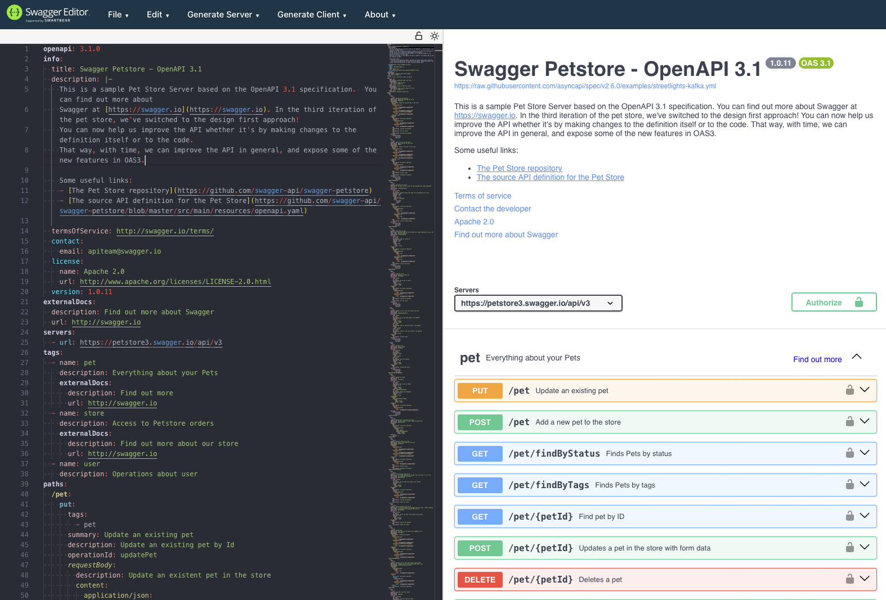
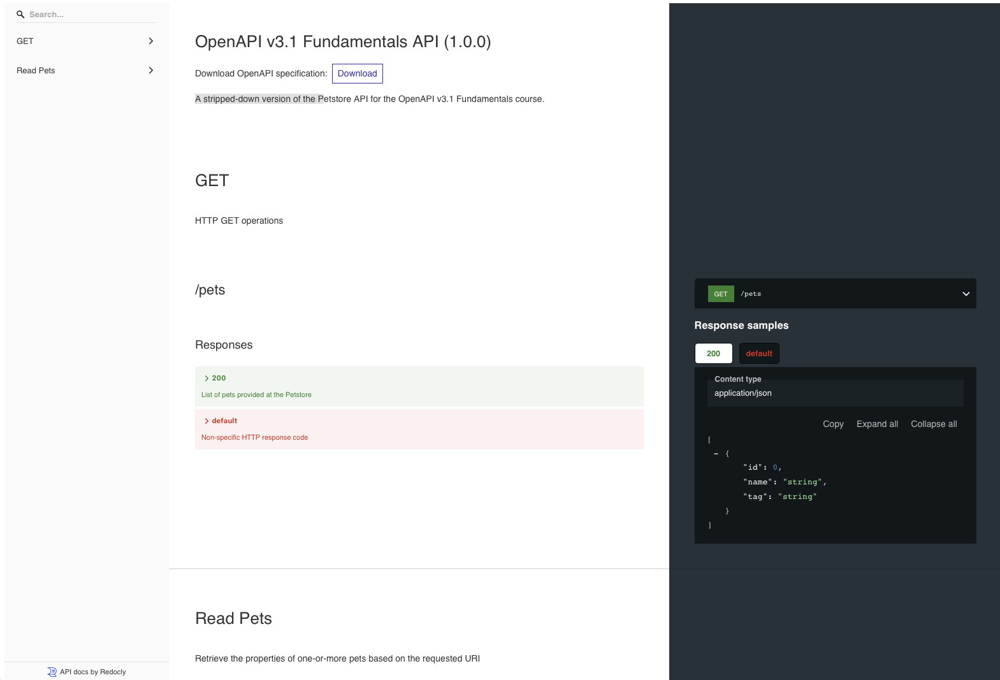

# Creating an OpenAPI Description

## Introduction

### Chapter Overview

Creating an OpenAPI description is one of the ways an API provider can communicate the shape of their API to their developer community. Creating an OpenAPI description is not, however, defined through a single, one-size-fits-all approach. Different programming languages and tooling makers have different perspectives on how an OpenAPI description should be created. The different approaches generally coalesce into two approaches --- design-first and code-first.

Design-first and code-first methodologies have grown organically and are tied to both OpenAPI-compatible tooling and how orientated API designers are to writing software.

**Design-first** refers to creating an API description that reflects the requirements for your API that you've gathered from your (potential) API consumers. You draw out the required Paths, Path Items, Operations, and Schema objects you need. You then use this description to create your implementation in code, plus perform other activities like generating documentation and setting up test cases.

With **code-first**, you start by writing your implementation code and use this to drive the shape of the API. You either build the structure of your API from scratch or use a framework of your choice. You annotate your code and generate an OpenAPI description based on the shape of the implementation code.

The decision to use design-first or code-first is an important consideration for developers and the organizations they work for. Each approach has implications and side effects that can affect how OpenAPI descriptions are maintained and published. It is important to understand these implications to help you make an informed decision on the approach that best fits your needs.

### Learning Objectives

By the end of this chapter you should be able to:

- Describe the differences between design-first and code-first methodologies.

- Describe the design-first approach and the tools that can support it.

- Discuss the code-first methodology and examples of using code-first using Java and Python.

- Decide whether the design-first or code-first methodology best suits your needs, based on your role and what kind of organization you work for.

## Using Design-first

### Why Design-first Works

Design-first is the favored approach for many API designers and consumers of OpenAPI descriptions because you see instant results. Crafting your API directly in OpenAPI or using a graphical tool that gives you a visually stimulating model means that you can readily understand the shape of your API and allow others to provide feedback. This might seem like a simple point, but it opens up creating APIs for many people who **_don't_** cut code: product managers, architects, and so on. This is especially important in areas like the development of market standards because developers are not always responsible for the shape of an API. That shape can have many stakeholders who need to review it before any code is cut.

The design-first approach can also be _straightforward_ from a tooling perspective. You can use a text editor and your knowledge of OpenAPI to create a description. However, many editing tools are available, some text-based and some graphical, that can help you create an OpenAPI description from scratch.

To provide an example, we will use a text editor that allows you to create the shape of your API design but also offers a graphical view of your API as you design it. That view is not the only way that an API can be visualized, but it is an excellent place to get started, as you'll see the structure of the OpenAPI description as you create it.

### Creating an OpenAPI Description in Swagger Editor

To show an example of one approach to design-first, we are using Swagger Editor, arguably the most freely available editing tool for OpenAPI. Despite its name - Swagger being a reference to the pre-OpenAPI name of the specification - the latest version of Swagger Editor supports all versions, including 3.1. Getting started is as easy as going to the correct URL: [Swagger Editor](https://editor-next.swagger.io/).

When you get there for the first time, you will see the default, expanded version of the Petstore API:



**Petstore API Screenshot in Swagger Editor**

You can clear the pane on the left-hand side, and the rendered view of the API will be removed. A blank canvas is often a good way to start, as it makes you think about the way an API is structured with an open mind. You can use your editor as a notebook, getting the most important "facts" about your API into place before assessing what the finer details need to look like.

### Adding an Info Object

To turn the blank view of your API into something, copy-and-paste the following snippet into Swagger Editor. Double-check that the snippet is correct after pasting, as formatting may be affected:

```yaml
openapi: 3.1.0
info:
  title: OpenAPI v3.1 Fundamentals API
  description: A stripped-down version of the Petstore API for the OpenAPI v3.1 Fundamentals course.
  version: 1.0.0
paths:
  /pets:
    get:
      responses:
        "200":
          description: OK
```

This is about as minimal an API specification as we can get (although admittedly we could have an empty Paths object, but that doesn't help us much). As you can see, it isn't very informative, but gets the very basics of a valid structure, namely:

- We have provided the title of your API and a version.

- We have defined a get operation hosted at the URL /pets, which can return an HTTP 200 response code.

This API specification, however, is insufficient for an API consumer. We don't tell them anything about parameters, HTTP header fields, the shape of request or response bodies, or failures. The next, most useful feature we can add here is a representation of the response body using a Schema object, which tells our API consumers what the properties of a pet are.

### Adding a Response Payload

A Response object can be declared inline if desired, encapsulated in a Content and Media Type object to indicate that a JSON response body is supported using the Media Type `application/json`:

```yaml
openapi: 3.1.0
info:
  title: OpenAPI v3.1 Fundamentals API
  description: A stripped-down version of the Petstore API for the OpenAPI v3.1 Fundamentals course.
  version: 1.0.0
paths:
  /pets:
    get:
      responses:
        "200":
          description: OK
          content:
            application/json:
              schema:
                type: array
                maxItems: 100
                items:
                  type: object
                  required:
                    - id
                    - name
                  properties:
                    id:
                      type: integer
                      format: int64
                    name:
                      type: string
                    tag:
                      type: string
```

We know now this operation will return a response body encoded in JSON with an anonymous array of up to 100 pets. However, declaring the properties of the pet inline is probably not what we want to do, as we might want to reuse the object.

### Making a Response Reusable

To make the response reusable, we can move the Schema Object that defines Pet to the Components Object inside the schemas property and use a Reference Object to point to it:

```yaml
openapi: 3.1.0
info:
  title: OpenAPI v3.1 Fundamentals API
  description: A stripped-down version of the Petstore API for the OpenAPI v3.1 Fundamentals course.
  version: 1.0.0
paths:
  /pets:
    get:
      responses:
        "200":
          description: OK
          content:
            application/json:
              schema:
                type: array
                maxItems: 100
                items:
                  $ref: "#/components/schemas/Pet"
components:
  schemas:
    Pet:
      type: object
      required:
        - id
        - name
      properties:
        id:
          type: integer
          format: int64
        name:
          type: string
        tag:
          type: string
```

By making this move we are already set up to make our OpenAPI description more concise because we've set up the Pet schema for reuse. Now it can be reused using a Reference Object wherever required, which avoids redeclaring the Schema, bloating the OpenAPI description, and decreases the risk of different inline definitions getting out of sync.

### Returning Consistent Error Payloads

We can follow the same approach to reuse Schema Object definitions when we create the design for returning HTTP errors:

```yaml
openapi: 3.1.0
info:
  title: OpenAPI v3.1 Fundamentals API
  description: A stripped-down version of the Petstore API for the OpenAPI v3.1 Fundamentals course.
  version: 1.0.0
paths:
  /pets:
    get:
      responses:
        "200":
          summary: List of pets
          description: List of pets provided at the Petstore
          content:
            application/json:
              schema:
                type: array
                maxItems: 100
                items:
                  $ref: "#/components/schemas/Pet"
        default:
          description: Non-specific HTTP response code
          content:
            application/json:
              schema:
                $ref: "#/components/schemas/Error"
components:
  schemas:
    Pet:
      type: object
      required:
        - id
        - name
      properties:
        id:
          type: integer
          format: int64
        name:
          type: string
        tag:
          type: string
    Error:
      type: object
      required:
        - code
      properties:
        code:
          type: integer
          format: int32
        message:
          type: string
```

We've used the default property in this iteration rather than specific return codes, allowing us to provide a catchall for anything else returned. Note also that the integer properties are qualified with the format property, indicating whether the values are signed or unsigned. Providing such information is one of the key features of OpenAPI, in that we are providing useful information to consumers of APIs upfront so they can reflect it in their implementation code.

### Adding Tags to Operations

The next step - although optional - is to add some tags. The [Tag Object](https://spec.openapis.org/oas/v3.1.1.html#tag-object) helps API providers classify their Path Items for users so that they can more readily navigate the available Operations.

Adding one or more tags to an Operation means adding a property called **tags**, which is an array:

```yaml
paths:
  /pets:
    tags:
      - GET
      - Read Pets
    get:
      responses:
        "200":
        ...
```

You can also add a root-level Tags Object that facilitates rendering Tag Objects with a description:

```yaml
tags:
  - name: GET
    description: HTTP GET operations
  - name: Read Pets
    description: Retrieve the properties of one-or-more pets based on the requested URI
```

The documentation tool [Redoc](https://github.com/Redocly/redoc) provides an example of how tags are used in rendering the display shown below. The tags drive the navigation menu on the left-hand side, with the API provider responsible for providing meaningful data so the navigation menu is helpful to the API consumer:



**Example of Tags Enabling Navigation in Redoc**

The tags here are used as an example. The way they are structured, so that multiple tags reference a single endpoint, is not the best way of tagging. Taking this approach sends confusing signals to the user of the API documentation, and makes navigation harder. It is usually better to use only one tag, which accurately and concisely describes the grouping of the endpoints, which ensures information is only found in one place. Although unavoidable in this example, it also doesn't make sense to create tags that only reference one operation, as this inherently makes navigation harder. Tags are fundamentally a grouping mechanism, and should be used in this spirit.

However, it serves as an example as some tooling makers might support such tagging in a useful way.

### Adding Security Requirements

To complete our basic example we can add some security information that lets our API consumers know what secures the API. In the case of this example, we are using API keys, which we define using a [Security Scheme Object](https://spec.openapis.org/oas/v3.1.1.html#security-scheme-object):

```yaml
components:
  securitySchemes:
    apiKey:
      description: API key as provided in Petstore portal
      type: apiKey
      in: header
      name: api-key
```

This example specifies an API key that is sent using an HTTP header field called `api-key`. We can add this Security Scheme Object to the document root as a global [Security Requirement](https://spec.openapis.org/oas/v3.1.1.html#security-requirement-object) so it applies to all Operations:

```yaml
security:
  - apiKey: []
```

As you will recall from our previous chapter, an array is provided as this allows OAuth scopes to be provided for a given Security Requirement. As an API key is not an OAuth-based Security Scheme, no scope values are required.

### Other Information

Another piece of information we could add, which was mentioned in the previous chapter, is a [Server Object](https://spec.openapis.org/oas/v3.1.1.html#server-object). The Server Object provides the properties of a deployed instance of the API, with the URL at which the API is accessible, a description of the instance, and a mapping of variables to a given value (for example, defining the port the API is published on). Server objects are grouped in the **servers** property, which provides all the instances available for the API. However, given we are doing design-first and don't know anything about the deployment, we aren't adding a Server Object. We'll see a Server Object when we look at the code-first example.

We've, therefore, built a very simple OpenAPI description that provides enough information for an API consumer to get working with our API and, in the case of so many organizations, provides information for testers, technical writers, and other users of the OpenAPI description. We've created this design before any implementation work has started, which allows for quick feedback and design iterations.

We have not used anything other than an OpenAPI-compatible editor to build our OpenAPI description, but it gives many consumers of this information a starting point for their work. It also gives them a means to readily test that the API is designed to meet their requirements and can also be validated against internal API standards.

### Complete Example

Before we go on, load the [complete design-first example](https://github.com/lftraining/LFELL1011-resources/blob/main/chapter-4-examples/design-first-example/design-first-example-openapi.yaml) into Swagger Editor so you can review all the operations supported by the API.

Please note:

- There are Operations to both create a pet and retrieve the properties of a pet using the identifier **petId**.

- These Operations are based on Reference Objects as we previously described to reuse existing definitions.

- The security model is inherited from the global Security Requirement, so no Security Requirements are found in any operation.

Reviewing the OpenAPI description as it stands will be useful when you look at the code-first approach below. Take note of the URLs that the Path Item Objects are mapped to, the Operations that are implemented for each Path Item, and how Request Body and Response Objects are created. Keep this in mind when you look at the code samples, as it will help you think about the design approach that best fits your needs.

## Using Code-first

### Why Code-first Works

Design-first has many benefits for rapid prototyping and shaping ideas. However, code-first is probably the more mature of the two design methodologies discussed in this chapter. The reason for this is quite simple: Implementation code predated API description languages, which in turn were born from the need to produce a schematic representation of an API for consumption outside the code base. The API economy and software engineering in general have had this need for a long time. We cannot simply throw open our code repositories and invite any external collaborators in to view our implementation code. We need the means to describe the shape of our API outside our safe and secure codebase. That fact is true regardless of whether we are going with code-first or design-first, but it's all the more pertinent in the code-first world. The reason that API description languages came into being is so that developers could automatically generate API-related documentation based on the shape of their implementation code and provide the description to external consumers.

The methodology is generally as follows:

1.  Write implementation code that reflects a given interaction with the API.

2.  Implement routing to provide request and response operations.

3.  Apply meaningful annotations that can transpose the "shape" of the code to an API description document.

4.  Generate the API description document at build time, source control it, and distribute the document to interested parties.

This approach has grown organically, matured over time, and is not unique to OpenAPI. There is also a huge number of packages that support code-first. We have two examples in the following sections that use springdoc-openapi and APIFlask, written in Java and Python respectively, to demonstrate how code-first works with popular programming languages and frameworks. In both examples, we will use the stripped-down Petstore API we created in the design-first section as the implementation requirement, and show how this OpenAPI description would be generated from code.

### Code-first Using Java and springdoc-openapi

[Springdoc-openapi](https://springdoc.org/) is a library designed for [Spring Boot](https://spring.io/projects/spring-boot) applications, a popular Java library with built-in support for creating APIs.

[Our example](https://github.com/lftraining/LFELL1011-resources/tree/main/chapter-4-examples/code-first-using-springdoc-openapi), provided in the course repository, is an _extremely basic_ Spring Boot application that serves to demonstrate the annotations available with springdoc-openapi. Springdoc-openapi provides an introspection mechanism for Spring Boot web applications that serves as the starting point for building an OpenAPI description. It then leverages **swagger.io** packages to provide additional annotations. The example project was initialized using the Spring Boot CLI and follows a typical boilerplate commonly found in API-related projects. The example [README](https://github.com/lftraining/LFELL1011-resources/tree/main/chapter-4-examples/code-first-using-springdoc-openapi#readme) provides details on getting this example up and running.

Please note that there is **zero complexity** in this or the Python-based example - no unit tests, backend, external services, etc - and this is for good reason. The idea is to show how to generate an OpenAPI description using a code-first methodology, not to build a fully-featured API in Java. We give enough indicators in the description below to describe what's going on, but not a full digest of the code base itself. We also **do not** provide instructions on exposing the OpenAPI description through Swagger UI, Redoc, _et al_. This style of tutorial is freely available on the internet (for example, this [DZone article: _OpenAPI 3 Documentation With Spring Boot_](https://dzone.com/articles/openapi-3-documentation-with-spring-boot)). The point of our example is simply to provide more context on the decision to go with a code-first methodology.

#### Adding an Info Object

Applying a code-first approach is, generally speaking, a reflection of how you develop your software as there's no "one-size-fits-all" methodology. The tools and utilities you use will drive _some_ of how you develop your code, but much of it will be of your choosing.

With that in mind, the walk through the example code reflects our use of the design-first section as our reference rather than as a prescribed approach. First off, we provide an Info Object that tells consumers of our OpenAPI description about the API: The title, version, description plus any other relevant information we can provide in the Info Object.

In the example we've defined a [separate class](https://github.com/lftraining/LFELL1011-resources/blob/main/chapter-4-examples/code-first-using-springdoc-openapi/src/main/java/org/openapis/course/config/CodeFirstConfig.java) to encapsulate this information:

```java
@Bean
public OpenAPI customOpenAPI(@Value("${application-description}") String appDesciption,
    @Value("${application-version}") String appVersion) {
  return new OpenAPI()
      .info(new Info()
          .title("OpenAPI v3.1 Fundamentals Example")
          .version(appVersion)
          .description(appDesciption));
}
```

Some of the information is populated using application configuration, to avoid hard-coding it. In this case, the version published in the OpenAPI description is sourced from the application configuration, so it stays in lockstep with the version of the application. This is not the only way to version your OpenAPI description, and you should consider what best fits the needs of your API consumers.

#### Adding a Response Payload

Our next step is to define some classes that represent our request and response payloads. This step is completed before adding Paths and Operations because it makes sense to have the classes available before creating annotations that reference them.

First, there is the representation of a Pet, implemented as the Pet class:

```java
package org.openapis.course.model;

public class Pet {
  private Integer id;
  private String name;
  private String tag;

  public Integer getId() {
    return id;
  }

  public void setId(Integer id) {
    this.id = id;
  }

  public String getName() {
    return name;
  }

  public void setName(String name) {
    this.name = name;
  }

  public String getTag() {
    return tag;
  }

  public void setTag(String tag) {
    this.tag = tag;
  }
}
```

This implementation used typical getters and setters for the properties of a pet. Obviously, there are other options, such as using `lombok.AllArgsConstructor` to avoid implementing getters and setters, which we did for the Error class:

```java
package org.openapis.course.model;

import lombok.AllArgsConstructor;
import lombok.Data;

@Data
@AllArgsConstructor
public class Error {
  private Integer code;
  private String message;
}
```

Again, and not to labor the point, there are multiple ways to implement your code here, and both of these mechanisms are compatible with the introspection springdoc-openapi does to generate OpenAPI from your models. A recurring theme with code-first, you are likely to find a great deal of flexibility in how tools can help you create an OpenAPI description.

#### Adding Paths and Operations

ith the Pet and Error models in hand, we can define the contents of our Paths Object, which specifies the URLs by which each Operation (the combination of URL and HTTP method) is available. This is done in our example using the Spring Boot `@GetProperty` and `@PostProperty` annotations, as this is what our API implements, together with annotations that provide both `summary` and `description` properties for the Path Items in our API. Springdoc-openapi combines this information to produce the OpenAPI description.

The encoding of the request and response payloads is also qualified using the **MediaType** class, which uses the constant APPLICATION_JSON_VALUE to indicate that the Content-type header field should be set to `application/json`. This will be reflected in the OpenAPI description:

```java
@Operation(summary = "Get pet by ID", description = "Retrieve a pet by its ID", operationId = "getPetById", responses = {
    @ApiResponse(description = "Pet found", responseCode = "200", content = @Content(schema = @Schema(implementation = Pet.class))),
    @ApiResponse(responseCode = "default", content = @Content(schema = @Schema(implementation = Error.class)))
})
@GetMapping(path = "/pets/{petId}", produces = { MediaType.APPLICATION_JSON_VALUE })
@ResponseBody
public ResponseEntity<?> getPetById(@PathVariable Integer petId) {
  Pet pet = allPetsMap.get(petId);
  if (pet == null) {
    Error errorResponse = new Error(1000, "Unknown Pet identifier");
    return ResponseEntity.status(HttpStatus.BAD_REQUEST).body(errorResponse);
  }
  return ResponseEntity.ok().body(pet);
}
```

### Comparing Design-first

Now is a good time to compare the code with the OpenAPI description that is generated. If you followed the [set-up instructions](https://github.com/lftraining/LFELL1011-resources/tree/main/chapter-4-examples/code-first-using-springdoc-openapi#pre-requisites) in the course repository you should be able to run the following command from the repository root directory to generate a fresh copy of the OpenAPI description:

`./gradlew clean generateOpenApiDocs`

The new document can be found at **./build/openapi/code-first-openapi.yaml**. You'll note a couple of things about the OpenAPI description that is generated:

- The OpenAPI description includes a **servers** property, with the value of your local instance provided by springdoc-openapi. This may appear useful at first glance, but most likely you are going to want to include other values in this property, some of which you are not in control of or do not know because they are specified using other means or by other teams.

- Springdoc-openapi will make some assumptions about Schema Objects that will be available for reuse, and create a Component Object, Schema Objects, and Reference Objects as required.

These features indicate a repeated theme in the OpenAPI world, namely that a given OpenAPI description represents the shape and configuration of an API at a point in time and to a certain extent, the perspective of tooling makers. However, there is usually information outside the development team that will need to be added later in the API lifecycle.

The code-first world includes many examples like this, regardless of the programming language and application development framework, where the tooling maker makes a judgment about what is useful for the API provider but cannot foresee how the OpenAPI description will be used in practicality. The impact of such decisions will become more obvious in the "Using an OpenAPI description" chapter when we look at OpenAPI from the viewpoint of an API consumer.

### Code-first using Python and APIFlask

Code-first is an option in virtually any programming language and different approaches abound. For our Python example, we use [APIFlask](https://github.com/apiflask/apiflask), a library that provides a wrapper on the very popular [Flask](https://flask.palletsprojects.com/en/3.0.x/) framework that adds OpenAPI functionality.

Like the springdoc-openapi project, [our example](https://github.com/lftraining/LFELL1011-resources/tree/main/chapter-4-examples/code-first-using-apiflask) is a very basic application that demonstrates using APIFlask to add OpenAPI annotations to the API. Note that in this example we use the bare minimum from APIFlask, to keep as close to a native Flask application as possible. The example also purposefully takes a few shortcuts in the application to demonstrate specific features of the code-first approach. Experienced API developers would almost certainly improve and simplify this codebase.

#### Adding an Info Object

Walking through the example in the same way we did with the Spring Boot application, the APIFlask object is created first in the same way as a regular Flask application. APIFlask includes arguments that provide the title of our API and its version, and we can also update the description and OpenAPI version to provide the basis of the OpenAPI description we'll generate:

```python
# Application config including OpenAPI version, title, description and API version
app = APIFlask(
    __name__,
    title="OpenAPI v3.1 Fundamentals Example",
    version="1.0.0",
)
app.config["DESCRIPTION"] = (
    "A stripped-down version of the Petstore API for the OpenAPI v3.1 Fundamentals course."
)
app.config["OPENAPI_VERSION"] = "3.1.0"
```

The Info Object example provides the API consumer with high-level information on the API.

#### Adding a Response Payload

We can then create classes as models for our payloads. For example, the snippet shows the [`PetProperties` class](https://github.com/lftraining/LFELL1011-resources/blob/main/chapter-4-examples/code-first-using-apiflask/pet_properties.py) that will be bound to a request body. In this class, we provided annotations that define a description of each property in our OpenAPI description:

```python
from dataclasses import field
from apiflask import Schema
from marshmallow_dataclass import dataclass


@dataclass
class PetProperties(Schema):
    """Attributes of a Pet that can be added to the Petstore"""

    name: str = field(metadata={"description": "Name of the pet", "required": True})
    tag: str = field(metadata={"description": "Pet category", "required": False})
```

As with the Java example in our implementation, we've teamed up APIFlask with the `marshmallow_dataclass` to both simplify our implementation and add relevant annotations to describe the properties of the class.

#### Adding Paths and Operations

Each route is then annotated using the doc decorator, which is populated with the `operationId` values, tags, and any other information. APIFlask also allows the default responses we created in the design-first OpenAPI description to be associated with a route, meaning it is pulled into the output document. The routes are also bound to the request and response classes using the **input** and **output** decorators.

The example below shows the `post` Operation on the Path Item `pets`:

```python
@app.post("/pets")
@app.doc(
    operation_id="CreatePet",
    tags=["POST", "Create a Pet"],
    responses=default_responses_schema,
)
@app.input(PetProperties.Schema)
@app.output(EmptySchema, status_code=201)
def post_pets(json_data):
    """Create a new Pet

    Add a new Pet to the collection of pets at the Petstore API
    """

    global LAST_PET_ID
    global PETS

    # Belt-and-braces check but probably not necessary
    if json_data.name is None:
        raise MissingRequestProperty

    LAST_PET_ID = LAST_PET_ID + 1
    new_pet = Pet(LAST_PET_ID, json_data.name, json_data.tag)
    PETS[LAST_PET_ID] = new_pet

    return make_response("", 201)
```

### Code-first Tasks

We've walked through the design-first approach and code-first approach using frameworks in both Java and Python.

If code-first looks like your preferred approach, take some time to explore these examples in more detail and make changes to the code samples that affect the shape of the OpenAPI description that is generated. To provide some focus in this exploration, we have provided some more targeted tasks below that you can undertake. You'll need to use the [springdoc-openapi](https://springdoc.org) and [APIFlask](https://apiflask.com/openapi/) documents for guidance.

We use excerpts of an OpenAPI description to set the requirement.

#### Delete a Pet resource

Most APIs that allow you to create a resource also provide the means to delete them.

Amend your API to provide a delete endpoint and annotate it so the following snippet of OpenAPI is matched (with the correct indentation in the generated OpenAPI description where it has to appear within a Path Item object):

```yaml
delete:
  summary: Delete a Pet
  description: Delete a Pet resource using the petId
  operationId: DeletePet
  responses:
    "204":
      description: Pet deleted
    default:
      content:
        application/json:
          schema:
            $ref: "#/components/schemas/Error"
```

Note the absence of a response body in the requirement. The 204 response code indicates no content is returned, meaning there is no requirement to include a definition in the OpenAPI description.

#### Add a Tag

The tags we've provided in our design can be changed in any manner you see fit. Add a tag that classifies the delete operation above with the tag "HTTP DELETE Operations" and provide a suitable description.

#### Add a Link

We briefly mentioned the [Link Object](https://spec.openapis.org/oas/v3.1.1.html#link-object) in the previous chapter, which is a good way to provide information to relate one request to another. OpenAPI provides this as a way of providing this information deterministically and at design time so that consumers of your API can understand it and accommodate it in their clients.

Take the following simple example from the CreatePets operation:

```yaml
responses:
  "201":
    description: Created
    content:
      application/json:
        schema:
          type: object
          required:
            - petId
          properties:
            petId:
              type: string
    links:
      GetDetailsOfPet:
        operationId: getPet
        parameters:
          petId: $response.body#/petId
```

What this example says is:

- When a 201 return code is returned a relationship has been provided between two Operations based on the object GetDetailsOfPet.

- The target operation has the `operationId` value of `getPet`.

- You can use the value of `petId` returned in the response body to set the `petId` parameter for the `getPet` operation.

This simple example shows how powerful the information contained in a Link Object can be. Take time to replicate this in the Java or Python codebase. Documentation is available for both [Java](https://github.com/swagger-api/swagger-core/wiki/Swagger-2.X---Annotations#link) and [Python](https://apiflask.com/openapi/#response-links) that will help you get started.

## Deciding on Design-first versus Code-first

### Which Approach Fits Your Needs?

On a project-by-project basis, your choice of adopting code-first, design-first, or maybe both, rests on several factors.

First off, who are you, and what role do you play? This factor is often the most important consideration when deciding on a particular methodology. If you are a developer, you may feel that it's code-first and nothing else; you are in charge of the shape of the API, and the easiest way of ensuring that it is through tying it to the code base as closely as possible.

However, if you are not a developer but are rather in charge of setting the requirements for software development teams, you may feel that design-first suits your needs. You can sketch out the shape of the API using an OpenAPI description, supported by tooling, and use this as version 0.1.0 of the API, which is then implemented in code. Design-first may be especially attractive because you pull on industry standards - with pre-canned Schema Objects in either OpenAPI or JSON Schema - to create your request and response payloads.

In most organizations, there is no binary choice between the code-first and design-first methodologies. There will be cases where generating OpenAPI descriptions from code makes sense. In contrast, in others, there's motivation to do design upfront due to specific product team requirements that influence the shape of the API. It's also worth thinking about the approach by asking yourself a few questions:

- Is the code base the best place to deal with tags and their descriptions?

- If you need to change the description of an Operation or Schema Object property is it easy for someone responsible to do this?

- Is it easy to change information that is altered when an instance of the API is deployed?

The answers to those questions will likely indicate a mix of responses that, in some cases, favor design-first, and in others, code-first. Many organizations opt for a hybrid approach, where code-first allows the shape of the API to be driven close to the code base, ensuring the interface and the implementation stay in sync. Alongside this, the principles of design-first enable copywriting teams to add suitable descriptions and information outside the code delivery mechanisms, embellishing the shape of the API with information suitable for display and, therefore, digestion by humans through "DocOps", or a documentation pipeline. This approach also allows API governance to be applied outside the code base, with activities such as standards compliance and versioning being orchestrated away from source control. Think of our code-first examples; if you are a developer, would it be practical for you or a technical writer to maintain all the descriptions in your code base?

### Taking a Lifecycle View

Your efforts and how to take the right approach ideally needs to be rooted in how you approach the lifecycle of your APIs.

Take the following hypothetical API lifecycle as an example:


**The API lifecycle as imagined by OpenAPI Initiative**
**_Source: [OpenAPI Initiative](https://www.openapis.org/)_**

At each stage, there is potentially a need to process a given OpenAPI description, with the wants and needs of the API consumer at that stage being different from what the developer adds to the codebase. An API provider must be aware of the diverse audiences and their roles, and cater to how they interact with them, ensuring that the information provided in a particular OpenAPI description is as comprehensive as possible. Most important is being aware that the development team is not necessarily the sole arbiter of the content of an OpenAPI description, and other contributors need to be enabled accordingly.

The choice you make in terms of code-first versus design-first will be influenced by many factors, including who you are, what type of organization you work in, and who needs to consume your OpenAPI description. You should, therefore, invest time in assessing your wants and needs based on the details above, and make choices that give you the best chance of success.

## Knowledge Check

Congratulations on completing Chapter 3 - Creating an OpenAPI description. Take this quiz to check your understanding of the concepts you've learned about so far.

### Question 1

What are considered to be the two main methodologies for creating APIs?

**_Select all that apply_**

- [ ] Requirements-first

- [x] Design-first

- [x] Code-first

- [ ] All of the above

### Question 2

What tools and experience do you need to create an OpenAPI description using design-first? **_Select all that apply_**

- [ ] An IDE installed

- [x] Knowledge of OpenAPI

- [x] A text editor

- [ ] None of the above

### Question 3

Select one way that Tags can be used.

- [ ] Introduce a taxonomy of APIs in your organization

- [x] Provide the means to group Operations by a common coarse-grained identifier

- [ ] Allow attributes to be sent in your API request

- [ ] Specify additional metadata in your Schema object properties

### Question 4

What application framework is springdoc-openapi used with?

- [x] Spring Boot

- [ ] Struts

- [ ] Dagger

- [ ] Play

### Question 5

In both code-first examples presented in the chapter, how was the Info Object set?

- [ ] Added manually after the OpenAPI description is generated

- [ ] Using arguments passed into the common-line tools

- [ ] By introspection

- [x] Using custom arguments or properties provided by the supporting packages

### Question 6

Select two side effects of using the code-first approach.

- [ ] You can only update your OpenAPI description in your code base

- [x] Your OpenAPI description may contain additional information based on the tooling makers' opinion

- [ ] The encoding of your OpenAPI description may not be in JSON or YAML

- [x] You may have to make compromises in the OpenAPI description you provide to API consumers

### Question 7

What is the **servers** property?

- [ ] A list of servers used in the development of your API

- [ ] A list of servers used in the test of your API

- [x] A list of deployed, available instances of the API described in an OpenAPI description

- [ ] A list of the most popular waiting staff in town

### Question 8

What is a Link Object?

- [x] A way of describing the link between two Operations in OpenAPI

- [ ] A URL that provides external documentation

- [ ] A URL that provides the terms and conditions of using the OpenAPI

- [ ] None of the above

### Question 9

What framework can you use to organize API-related activities in your organization?

- [ ] Use guidance provided by a project manager

- [ ] Use requirements set by your developer community

- [x] Use an API lifecycle to qualify how you perform the activities

- [ ] Look at that piecemeal as an unstructured approach works best

### Question 10

When deciding between code-first or design-first methodologies, what is the most important point to consider?

- [x] How descriptions of operations and objects can be updated

- [ ] Your choice of programming language

- [ ] The number of APIs in your API catalog

- [ ] The size of your organization
