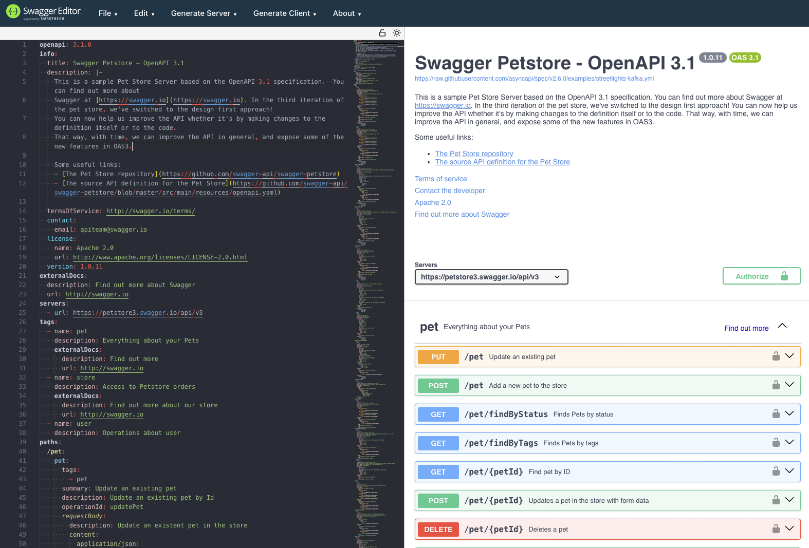

# Creating an OpenAPI description

## Introduction

### Chapter Overview

Creating an OpenAPI description is one of the ways an API provider can communicate the shape of their API to API consumers. Creating an OpenAPI description is not, however, defined through a single, one-size-fits-all approach. Different programming languages and tooling makers have different perspectives on how an OpenAPI description should be created. The variety of different approaches can generally be described as either design-first or code-first.

Design-first and code-first methodologies have grown organically and are tied to both tooling and how orientated API designers are to writing software. Design-first means starting with the specification based on your wants and needs as the creator of the API. You draw out the required Paths, Path Items, Operations and Schema objects you need. You then use this description for creating your implementation in code, plus other activities like generating documentation and setting up test cases. With code-first you start by writing your implementation code and use this to drive the shape of the API. You either build the structure of your API from scratch or use a framework of your choice. You annotate your code and generate an OpenAPI description based on the shape of the implementation code.

The decision to use design-first or code-first is an important consideration for developers and the organizations they work for. Each approach has implications and side effects that can affect how OpenAPI descriptions are maintained and published. It is important to understand these implications to help make an informed decision on the approach that best fits your needs.

### Learning Objectives

By the end of this chapter you should understand:

- The difference between design-first and code-first methodologies.
- How you can approach design-first and the tools that can support you.
- What code-first means and how you can approach it using Java and Python.
- How to decide what best suits your needs based on who you are and what kind of organization you work for.

In this module we'll also introduce some OpenAPI features we didn't go into in Chapter 2. We introduce them here to ensure you have the best chance of creating rich OpenAPI descriptions once you've taken the course.

## Using Design-first

### Why Design-first Works

Design-first is the favored approach for many API designers and consumers of OpenAPI descriptions because you see instant results. Crafting your API directly in OpenAPI or using a graphical tool that gives you a visually stimulating model means that you can readily understand the shape of your API and allow others to provide feedback. This might seem like a simple point, but it opens up creating APIs to a whole bunch of people who **_don't_** cut code: product managers, architects and so on. This especially important in areas like the development of market standards because developers aren't always responsible for the shape of an API, and that shape can have many stakeholders who need to review it before any code is cut.

The design-first approach can be also be _very simple_ from a tooling perspective. You can use a text editor and your knowledge of OpenAPI to create a specification. However, there is myriad of editing tools available - some text-based, some graphical - that can help you create an OpenAPI description from scratch.

To provide an example we'll be use a text editor that allows you shape your API design but also offers a graphical view of your API as you design it. That view is not the only way that an API can be visualized, but it is a good place to get started as you'll see the structure of the OpenAPI description as you create it.

### Creating an OpenAPI description in Swagger Editor

To show an example of an approach to design-first we are using Swagger Editor, which is arguably the most freely-available editing tool for OpenAPI. Despite its name - Swagger being a reference to the pre-OpenAPI name of the specification - the latest version of Swagger Editor supports all versions include 3.1. Getting started is as easy as going to the [right URL](https://editor-next.swagger.io/).

When you get there for the first time you'll see the default, expanded version of the Petstore API:



You can clear the pane on the left-hand side and the rendered view of the API will be removed.

Starting with a blank canvas is often a good way to start as it makes you think about the way an API is structured with an open mind. You can use your editor as a notebook, getting the most important "facts" about your API into place before assessing what the finer details need to look like.

### Adding an Info Object

To turn the blank view of your API into something, copy-and-paste the follow snippet into the editor:

```yaml
openapi: 3.1.0
info:
  title: OpenAPI v3.1 Fundamentals API
  description: A stripped-down version of the Petstore API for the OpenAPI v3.1 Fundamentals course.
  version: 1.0.0
paths:
  /pets:
    get:
      responses:
        "200":
          description: OK
```

This is about as minimal an API specification as you can get (although admittedly you could have an empty Paths object, but that doesn't help us much).

It obviously isn't very informative, but gets the very basics of a valid structure namely:

- You have provided a title and version.
- A `get` operation hosted at the URI `/pets`.
- Requesting this endpoint will return a HTTP 200 response code.

This, however, in insufficient for an API consumer. We don't tell them anything about parameters, HTTP headers or shape of the request or response bodies. The next most useful we can add here is a representation of the response body using a Schema object, which tells our API consumers what the properties of a pet are.

### Adding a Response Payload

A response object can be declared inline if desired, encapsulated in a Content and Media Type object to indicate that a JSON response body is supported:

```yaml
openapi: 3.1.0
info:
  title: OpenAPI v3.1 Fundamentals API
  description: A stripped-down version of the Petstore API for the OpenAPI v3.1 Fundamentals course.
  version: 1.0.0
paths:
  /pets:
    get:
      responses:
        "200":
          description: OK
          content:
            application/json:
              schema:
                type: array
                maxItems: 100
                items:
                  type: object
                  required:
                    - id
                    - name
                  properties:
                    id:
                      type: integer
                      format: int64
                    name:
                      type: string
                    tag:
                      type: string
```

We know now this operation will return a response body encoded in JSON with a root array of up to 100 pets. However, declaring the properties of the pet inline is probably not what we want to do as we might want to reuse the object.

### Making a Response Reusable

We therefore move that to the Components Object inside the `schemas` property and use a Reference Object to point to it:

```yaml
openapi: 3.1.0
info:
  title: OpenAPI v3.1 Fundamentals API
  description: A stripped-down version of the Petstore API for the OpenAPI v3.1 Fundamentals course.
  version: 1.0.0
paths:
  /pets:
    get:
      responses:
        "200":
          description: OK
          content:
            application/json:
              schema:
                type: array
                maxItems: 100
                items:
                  $ref: "#/components/schemas/Pet"
components:
  schemas:
    type: object
    required:
      - id
      - name
    properties:
      id:
        type: integer
        format: int64
      name:
        type: string
      tag:
        type: string
```

In doing this we're already set-up to make our OpenAPI description more concise because we've set up the Pet property for reuse.

### Returning Consistent Error Payloads

We can do the same when we design for returning HTTP errors:

```yaml
openapi: 3.1.0
info:
  title: OpenAPI v3.1 Fundamentals API
  description: A stripped-down version of the Petstore API for the OpenAPI v3.1 Fundamentals course.
  version: 1.0.0
paths:
  /pets:
    get:
      responses:
        "200":
          summary: List of pets
          description: List of pets provided at the Petstore
          content:
            application/json:
              schema:
                type: array
                maxItems: 100
                items:
                  $ref: "#/components/schemas/Pet"
        default:
          description: Non-specific HTTP response code
          content:
            application/json:
              schema:
                $ref: "#/components/schemas/Error"
components:
  schemas:
    Pet:
      type: object
      required:
        - id
        - name
      properties:
        id:
          type: integer
          format: int64
        name:
          type: string
        tag:
          type: string
    Error:
      type: object
      required:
        - code
      properties:
        code:
          type: integer
          format: int32
        message:
          type: string
```

In this iteration we've used the `default` property rather than specific return codes, as this allows us to provide a catchall for anything else returned. Note also that the `integer` properties are qualified with the `format` property, indicating whether the values are signed or unsigned. Providing such information is one of the key features of OpenAPI, in that we are providing useful information to consumers of APIs upfront, so their reflect it in their implementation code.

### Adding Tags to Operations

The next step - although optional - is to add some tags. The [Tag Object](https://spec.openapis.org/oas/v3.1.0.html#tag-object) helps API providers classify their Path Items for users so that can more readily navigate the available Operations. Adding one-or-more tags to an Operation means adding a property called `tags`, which is an array:

```yaml
paths:
  /pets:
    tags:
      - GET
      - Read One-or-more Pets
    get:
      responses:
        "200":
        ...
```

You can also add a root-level Tags object that facilitates rendering Tag objects with a description:

```yaml
tags:
  - name: GET
    description: HTTP GET operations
  - name: Read Pets
    description: Retrieve the properties of one-or-more pets based on the requested URI
```

[Redoc](https://github.com/Redocly/redoc) provides an example of how tags are used in rendering the display shown below.

The tags drive the navigation menu on the left-hand side, with the API provider responsible for providing meaningful data so the navigation menu is helpful to the API consumer:


The tags here are used as an example and the way they are structured - so that multiple tags reference a single endpoint - is not the best way of tagging.

However, it serves as an example as some tooling makers might support such tagging in a useful way.

### Adding Security Requirements

To complete our basic example we need some security information that lets our API consumers know what secures the API. In the case of the example we are using API keys, which we define using a [Security Scheme object](https://spec.openapis.org/oas/v3.1.0.html#security-scheme-object):

```yaml
components:
  securitySchemes:
    apiKey:
      description: API key as provided in Petstore portal
      type: apiKey
      in: header
      name: api-key
```

This specifies an API key that is sent using a HTTP header called `api-key`. We can add this to the document root as a global [Security Requirement](https://spec.openapis.org/oas/v3.1.0.html#security-requirement-object) so it applies to all Operations:

```yaml
security:
  - apiKey: []
```

> To understand the empty array shown in the example please refer to our security section in Chapter 2.

### Other Information

Another piece of information we could add is a [Servers Object](https://spec.openapis.org/oas/v3.1.0.html#server-object) that provides a list of URLs that the API is accessible, a description of the instance and a mapping of variables to a given value (for example, defining the port the API is published on). As we are doing design-first and don't know anything about the deployment, however, we aren't adding this here. We'll see a server variable when we look at the code-first example.

We've therefore built a very simple OpenAPI description from nothing into something that provides enough information for an API consumer to get working with our API and - in the case of so many organizations - provide information for testers, technical writers, and other users of the OpenAPI description.

We've not used anything other than an OpenAPI editor to do this, but it gives so many consumers of this information a starting point for their work, plus a means to readily test that the API is designed to requirements and can be immediately compared to internal API standards.

### Complete Example

Before you go on, load the [complete design-first example](https://github.com/OAI/OAI-Courses/blob/main/chapter-3-examples/design-first-example/design-first-example-openapi.yaml) into Swagger Editor so you can review all the Operations supported by the API.

Please note:

- There are Operations to both create a pet and retrieve the properties of a pet using the identifier `petId`.
- These Operations implement Reference Objects as we described above to reuse existing definitions.
- The security model is inherited from the global Security Requirement, so no Security Requirements are found on any operation.

Reviewing the OpenAPI description as it stands will be useful when you look at the code-first approach below.

## Using Code-first

### Why Code-first Works

Design-first obviously has many benefits for rapid prototyping and shaping ideas.

However, code-first is probably most mature of the two design methodologies discussed in this module. The reason for this is quite simple, namely: Implementation code predated API specification languages, which in turn were born from the need to produce a schematic representation of an API for consumption outside the code base. This has long been a need in the API economy, and in software engineering in general. We cannot simply throw open out code repositories and invite any external collaborators in to view our implementation code. We need the means to provide this outside our safe and secure codebase.

That fact is true regardless of whether we are going with code-first or design-first, but it's all the more pertinent in the code-first world. The reason that API specification languages came into being is so developers could automatically generate API-related documentation based on the shape of their implementation code and provide the description to external consumers.

The methodology is generally as follows:

1. Write implementation code that reflects a given request or response.
2. Implement routing to provide request and response operations.
3. Apply meaningful annotations that can transpose the "shape" of the code to an API description document.
4. Generate the API description document at build time, source control it and distribute the document to interested parties.

This approach has grown organically and matured over time, and is not unique to OpenAPI. There is also a huge number of packages that support code-first.

We have two examples in the sections below that use springdoc-openapi and APIFlask, written in Java and Python respectively, to demonstrate how code-first works with popular programming languages and frameworks.

In both examples we'll use uses the stripped-down Petstore API we created in the design-first section as the implementation requirement, and show how this OpenAPI description would be generated from code.

### Code-first using Java and springdoc-openapi

[springdoc-openapi](https://springdoc.org/) is a library designed for [Spring Boot](https://spring.io/projects/spring-boot) applications, a popular Java library with built-in support for building APIs.

[Our example](chapter-3-examples/code-first-using-springdoc-openapi/) is a **_very basic_** Spring Boot application that serves to demonstrate the annotations available with [springdoc-openapi](https://springdoc.org/). springdoc-openapi provides an introspection mechanism for Spring Boot web application that serves as the starting point for building an OpenAPI description. It then leverages swagger.io packages to provide additional annotations.

The project was initialized using the Spring Boot CLI and follows typical boilerplate commonly found in API-related projects. The example [README](chapter-3-examples/code-first-using-springdoc/README.md) provides details on getting this example up-and-running.

Please note there almost zero complexity in this or the Python-based example - no unit tests, backend, external services, nothing - and this is for good reason.

The idea is to show how to generate an OpenAPI description using a code-first methodology, not to build a fully-featured API in Java. We give enough indicators in the description below to describe what's going on, but not a full digest of the code base itself.

We also **do not** provide instructions on exposing the OpenAPI description through Swagger UI, Redoc, _et al_. This style of tutorial is freely available on the internet. The point of this example is simply to provide more context on the decision you make to go with a code-first methodology.

### Adding an Info Object

Applying a code-first approach is, generally speaking, a reflection of how you develop your software as there's no "one-size-fits-all" methodology. The tools and utilities you use will drive _some_ of how you develop your code, but much of it will be of your own choosing.

With that in mind, the walk through the example in code will reflect using the design-first section as our reference rather than a prescribed approach. First off we will to provide an Info object that tells consumers of our OpenAPI description about the API: The title, version, description plus any other relevant information we can provide in the document Info object.

In the example we've defined a [separate class](chapter-3-examples/code-first-using-springdoc-openapi/src/main/java/org/openapis/first/code/config/CodeFirstConfig.java) to encapsulate this information, using application configuration as well to create the Info object:

```java
@Bean
public OpenAPI customOpenAPI(@Value("${application-description}") String appDesciption,
    @Value("${application-version}") String appVersion) {
  return new OpenAPI()
      .info(new Info()
          .title("OpenAPI v3.1 Fundamentals Example")
          .version(appVersion)
          .description(appDesciption));
}
```

### Adding a Response Payload

Our next step is to define some classes that represent our request and response payloads. This is done before adding Paths and Operations because it makes sense to have the classes available before creating annotations that reference them.

First there is the representation of the a Pet, implemented as the `Pet` class:

```java
package org.openapis.course.model;

public class Pet {
  private Integer id;
  private String name;
  private String tag;

  public Integer getId() {
    return id;
  }

  public void setId(Integer id) {
    this.id = id;
  }

  public String getName() {
    return name;
  }

  public void setName(String name) {
    this.name = name;
  }

  public String getTag() {
    return tag;
  }

  public void setTag(String tag) {
    this.tag = tag;
  }
}
```

This implementation used typical getters and setters for the properties of a pet. Obviously there are other options, such as using `lombok.AllArgsConstructor` to avoid implementing getters and setters:

```java
package org.openapis.course.model;

import lombok.AllArgsConstructor;
import lombok.Data;

@Data
@AllArgsConstructor
public class Error {
  private Integer code;
  private String message;
}
```

Again - and not to labor the point - there are multiple ways to implement your code here, and both of these mechanisms is compatible with the introspection springdoc-openapi does to generate OpenAPI from your models. This is a recurring theme with code-first, namely that you are likely to find a great deal of flexibility in how tools can help you create an OpenAPI description.

### Adding Paths and Operations

With the models for the pet and errors in hand we can define the contents of our Paths object, which specifies the URIs by which each Operation - the combination of URI and HTTP method are available.

This is done in our example using the Spring Boot `@GetProperty` and `@PostProperty` annotations - as this is what our API implements - together with annotations that provide both `summary` and `description` properties for the Path Items in our API. springdoc-openapi combines this information to produce the OpenAPI description.

The encoding of the request and response payloads is also qualified using the `MediaType` class, which uses the constant `APPLICATION_JSON_VALUE` to indicate the `Content-type` header will be set to `application/json`. This will be reflected in the OpenAPI description:

```java
@Operation(summary = "Get pet by ID", description = "Retrieve a pet by its ID", operationId = "getPetById", responses = {
    @ApiResponse(description = "Pet found", responseCode = "200", content = @Content(schema = @Schema(implementation = Pet.class))),
    @ApiResponse(responseCode = "default", content = @Content(schema = @Schema(implementation = Error.class)))
})
@GetMapping(path = "/pets/{petId}", produces = { MediaType.APPLICATION_JSON_VALUE })
@ResponseBody
public ResponseEntity<?> getPetById(@PathVariable Integer petId) {
  Pet pet = allPetsMap.get(petId);
  if (pet == null) {
    Error errorResponse = new Error(1000, "Unknown Pet identifier");
    return ResponseEntity.status(HttpStatus.BAD_REQUEST).body(errorResponse);
  }
  return ResponseEntity.ok().body(pet);
}
```

### Comparing Design-first

Now is good time to compare the code with the OpenAPI description that is generated. If you followed the set-up instructions you should be able to run the `generateOpenApiDocs` Gradle command to generate a fresh copy of the OpenAPI description.

You'll note a couple of things about this OpenAPI description:

- You've generated includes a `servers` property, with the value of your local instance provided by springdoc-openapi. This may appear useful at first glance, but most likely you are going to want to include other values in this property, some of which you are not in control of or do not know.
- springdoc-openapi will make some assumptions about Schema objects that'll be available for reuse, and create a Component object, Schema objects, and Reference objects as required.

These features indicate a repeated theme in the OpenAPI world namely that a given OpenAPI description represents the shape and configuration of an API at a point in time and to a certain extent the perspective of tooling makers. However, generally speaking there is information outside the development team that will need to be added later in the API lifecycle.

The code-first world includes many examples like this - regardless of the programming language and application development framework - where the tooling maker makes a judgment about what is useful for the API provider but cannot foresee the OpenAPI description will be used in practicality. The impact of such decisions will become more obvious in our Using an OpenAPI description module when we look at the OpenAPI from an API consumers viewpoint.

## Code-first using Python and APIFlask

Code-first is obviously an option in virtually any programming language and different approaches abound. For our Python example we use [APIFlask](https://github.com/apiflask/apiflask), a library that provides a wrapper on the very popular [Flask](https://flask.palletsprojects.com/en/3.0.x/) framework that brings OpenAPI functionality.

Like the springdoc-openapi project, [our example](chapter-3-examples/code-first-using-flask-openapi3/) is a very basic application that demonstrates using APIFlask to add OpenAPI annotations to the API. Note in this example we use the bare minimum from APIFlask, in order to keep as close to a native Flask application as possible. It also purposefully takes few shortcuts in the application, in order to demonstrate specific features of the code-first approach. Experienced API developers would almost certainly improve and simplify this codebase.

### Adding an Info Object

Walking through the example in the same way we did with the Spring Boot application, the APIFlask object is created first in the same way as a regular Flask application. APIFlask includes arguments that provide the title of our API and version, and we can also update the description and OpenAPI version to provide the basis of the OpenAPI description we'll generate:

```python
# Application config including OpenAPI version, title, description and API version
app = APIFlask(
    __name__,
    title="OpenAPI v3.1 Fundamentals Example",
    version="1.0.0",
)
app.config["DESCRIPTION"] = (
    "A stripped-down version of the Petstore API for the OpenAPI v3.1 Fundamentals course."
)
app.config["OPENAPI_VERSION"] = "3.1.0"
```

This provides the API consumer with the high-level information on the API.

### Adding a Response Payload

These can bound to specific classes, with the request payload being bound in this case to the [`PetProperties` class](chapter-3-examples/code-first-using-apiflask/pet_properties.py). In this class we provided annotations that provide description of each property in our OpenAPI description:

```python
from dataclasses import field
from apiflask import Schema
from marshmallow_dataclass import dataclass


@dataclass
class PetProperties(Schema):
    """Attributes of a Pet that can be added to the Petstore"""

    name: str = field(metadata={"description": "Name of the pet", "required": True})
    tag: str = field(metadata={"description": "Pet category", "required": False})
```

As with the Java example in our implementation we've teamed up APIFlask with the `marshmallow_dataclass` to both simplify our implementation and add relevant annotations to describe the properties of the class.

### Adding Paths and Operations

Each route is annotated using the `doc` decorator, which is populated with the `operationId`, tags and any other information. In this case APIFlask also allows the `default` responses we created in the design-first OpenAPI description to be associated with route, meaning it is pulled into the output document. The routes are also bound to the request and response classes using the `input` and `output` decorators.

The example below shows the `post` Operation on the Path Item `pets`:

```python
@app.post("/pets")
@app.doc(
    operation_id="CreatePet",
    tags=["POST", "Create a Pet"],
    responses=default_responses_schema,
)
@app.input(PetProperties.Schema)
@app.output(EmptySchema, status_code=201)
def post_pets(json_data):
    """Create a new Pet

    Add a new Pet to the collection of pets at the Petstore API
    """

    global LAST_PET_ID
    global PETS

    # Belt-and-braces check but probably not necessary
    if json_data.name is None:
        raise MissingRequestProperty

    LAST_PET_ID = LAST_PET_ID + 1
    new_pet = Pet(LAST_PET_ID, json_data.name, json_data.tag)
    PETS[LAST_PET_ID] = new_pet

    return make_response("", 201)
```

## Code-first Tasks

We've walked through the design-first approach and code-first approach using frameworks in both Java and Python.

If code-first looks like your preferred approach take some time to explore these examples in more detail and make changes to the code samples that affect the shape of the OpenAPI description that are generated.

To provide some focus in this exploration here are some more targeted tasks you can undertake. You'll need to use the springdoc-openapi and APIFlask documents for guidance.

We use excerpts of an OpenAPI description to set the requirement.

### Delete a Pet resource

Most APIs that allow you create a resource also provide the means to delete them.

Amend your API to provide a delete endpoint and annotate it so the following snippet of OpenAPI is matched (with the correct indentation in the generated OpenAPI description):

```yaml
delete:
  summary: Delete a Pet
  description: Delete a Pet resource using the petId
  operationId: DeletePet
  responses:
    "204":
      description: Pet deleted
    default:
      content:
        application/json:
          schema:
            $ref: "#/components/schemas/Error"
```

Note the absence of a response body in the requirement. The 204 response code indicates no content is returned meaning there is no requirement to include a definition in the OpenAPI description.

### Add a Tag

The tags we've provided in our design can be changed in any manner you see fit. Add a tag that allows the delete operation above to be classified with the tag "HTTP DELETE Operations" and provide a suitable description.

### Add a Link

We've not touched on the [Link Object](https://spec.openapis.org/oas/v3.1.0.html#link-object) yet but this is a way to provide information to relate one request to another. OpenAPI provides this as a way of providing this information deterministically and at design time so that consumers of your API can understand it and accommodate it in their client.

Take the following simple example:

```yaml
responses:
  "201":
    description: OK
    content:
      application/json:
        schema:
          type: object
          required:
            - petId
          properties:
            petId:
              type: string
    links:
      GetDetailsOfPet:
        operationId: getPet
        parameters:
          petId: $response.body#/petId
```

What this example says is:

- When a 201 return code is returned I am providing a relationship between two Operations based on the object GetDetailsOfPet.
- The target operation has the `operationId` value of `getPet`.
- You can use the value of `petId` returned in the response body to set the `petId` parameter for the `getPet` operation.

This simple example shows how powerful the information contained in a Link Object can be. Take time to replicate this in the Java or Python codebase (You'll need to do the research to find out how to do it).

## Deciding on Design-first versus Code-first

### What approach fits your needs?

You choice on adopting Code-first or API-first design - or maybe both, on a project-by-project basis - rests on a number of factors.

First off, who are you and what role do you play? This can often be the most important factor in deciding on a particular methodology. If you're a developer you may feel that its code-first and nothing else; you are in charge of the shape of the API, and the easiest way of ensuring that it by tieing it to the code base as closely as possible.

If, however, you are not a developer but in charge of setting the requirements for software development teams you may feel that design-first really suits your needs. You can sketch out the shape of the API using an OpenAPI description, supported by tooling, and use this as version 0.1.0 of the API, which is then implemented in code. This is especially attractive for you because you pull on industry standards - with pre-canned Schema Objects in either OpenAPI or JSON Schema - to create your request and response payloads.

In truth in most organizations there is no binary choice between the code-first and design-first methodologies. They'll be cases where it makes sense to generate OpenAPI descriptions from code, whilst in others there's motivation to do design upfront due to specific product team requirements that influence the shape of the API. It's also worth thinking about the approach by asking yourself a few questions:

- Is the code base the best place place to deal with tags and their descriptions?
- If you need to change the description of an Operation or Schema Object property is it easy for someone with responsibility to do this?
- If it easy to change information that it altered when an instance of the API is deployed?

The answers to those questions are likely to indicate a mix of responses that in some cases favour design-first and in others code-first. Many organisations actually opt for a hybrid approach, where code-first allows the shape of the API to be driven close to code base, ensuring the interface and the implementation stay in sync. Alongside this the principles of design-first enables copywriting teams to add suitable descriptions and information outside the code delivery mechanisms, embellishing the shape of the API with information suitable for display and therefore digestion by humans. This approach also allows API governance to be applied outside the code base, with activities such as standards compliance and versioning being orchestrated away from source control. Think of our code-first examples; if you are developer, would it practical for you or a technical writer to maintain all the descriptions in your code base?

### Taking a Lifecycle View

Your efforts and how to take the right approach therefore ideally needs to be couched in how you approach the lifecycle of your APIs.

Take the following hypothetical API lifecycle as an example:


At each stage there is potentially a need to process a given OpenAPI description, with the wants-and-needs of the API consumer at that stage being different to what the developer adds to the codebase. An API provider needs to be cognizant of the varied audiences and their roles, and cater for how the deal with ensuring the information provided in a given OpenAPI description is as complete as it possibly can be. Most important in this is being aware of the fact that the development team is not necessarily the sole arbiter of the content of an OpenAPI description, and other contributors need to be enabled accordingly.

The choice you make in terms of code-first verses design-first will there be influenced by many factors including who you are, what type of organization you work in who needs to consume your OpenAPI description. You should therefore invest time in assessing your wants-and-needs based on the details above, and make choices that given you the best chance of success.

## Knowledge Check

Congratulations on completing Chapter 3 - Creating an OpenAPI description. Take this quiz to check your understanding of the concepts you've learned about so far.

### Question 1

What are considered to be the two main methodologies for creating APIs?

- [ ] Requirements-first
- [x] Design-first
- [x] Code-first
- [ ] All of the above

### Question 2

What is the bare minimum you need to create an OpenAPI description using design-first?

- [ ] An IDE installed
- [x] Knowledge of OpenAPI
- [x] A text editor
- [ ] None of the above

### Question 3

What's one of the ways that Tags can be used?

- [ ] Introduce a taxonomy of APIs in your organization
- [x] Provide the means to group Operations by a common coarse-grained identifier
- [ ] Allow attributes to be sent in your API request
- [ ] Specify additional metadata in your Schema object properties

### Question 4

What application framework is springdoc-openapi used with?

- [x] Spring Boot
- [ ] Struts
- [ ] Dagger
- [ ] Play

### Question 5

In both code-first examples how was the Info object set?

- [ ] Added manually after the OpenAPI description is generated
- [ ] Using arguments passed into the common-line tools
- [ ] By introspection
- [x] Using custom arguments or properties provide by the supporting packages

### Question 6

Name a side effect of using the code-first approach

- [ ] You can only update your OpenAPI description in your code base
- [x] Your OpenAPI description may contain additional information based on the tooling makers' opinion
- [ ] The encoding of your OpenAPI description may not be in JSON or YAML
- [ ] You make have to make compromises in the OpenAPI description you provide to API consumers

### Question 7

What is the `servers` property?

- [ ] A list of servers used in the development of your API
- [ ] A list of servers used in the test of your API
- [x] A list of deployed, available instances of the API described in an OpenAPI description
- [ ] A list of the most popular waiting staff in town

### Question 8

What is a Link Object?

- [x] A way of describing the link between two Operations in OpenAPI
- [ ] A URL that provides external documentation
- [ ] A URL that provides the terms and conditions of using the OpenAPI
- [ ] None of the above

### Question 9

How you should think about the API-related activities that occur in your organization?

- [ ] Using guidance provided by a project manager
- [ ] Using requirements set by your developer community
- [x] Using an API lifecycle to qualify how you perform those activities
- [ ] Look at that piecemeal as an unstructured approach works best

### Question 10

What is a valid consideration when choosing a design methodology

- [x] The means by which descriptions of operations and objects can be updated
- [ ] Your choice of programming language
- [ ] How many APIs you have
- [ ] The size of your organization
