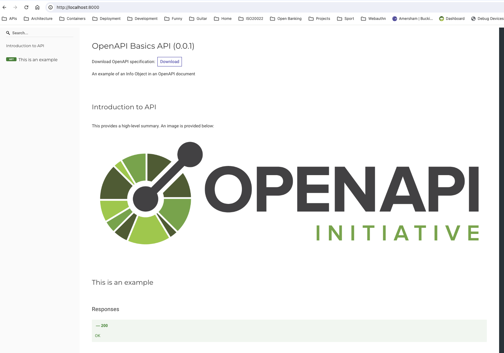

# OpenAPI Basics

Welcome to our course module “OpenAPI Basics”.

Hopefully you’ve enjoyed Module 1, “Introducing OpenAPI” which sets the scene on how OpenAPI came into being and its place in the API Economy.

In this second module we’ll dig more deeply into the syntax of OpenAPI and how the features of the language help people publishing APIs better describe their operations for their consumers. We’ll look at:

- The basics of HTTP-based APIs, which typify the API Economy.
- How OpenAPI maps the features of HTTP-based APIs to its specification language.
- The features OpenAPI introduces to expand beyond HTTP and reflect what needs to be communicated by API providers to API consumers.

By the end of this module you’ll understand the basic structure of an OpenAPI document and how this provides an effective vehicle for communicating API-related information.

First off we’ll review the available versions of OpenAPI.

## Versions of OpenAPI

As we touched on in Module 1 there has been a number of OpenAPI versions.

The first, Swagger, was retrospectively labelled 2.0 after it was donated by SmartBear. This became the baseline for 3.0, which was published in 2017.

The latest version, [3.1](https://spec.openapis.org/oas/v3.1.0.html), was published February 2021.

A new major version, currently codenamed Moonwalk, is [being developed](https://www.openapis.org/blog/2023/12/06/openapi-moonwalk-2024) with the goal of general availability in 2024. At the time of writing the construct of this version have yet to be agreed upon.

In this module wherever we refer to OpenAPI we mean version 3.1. Regardless of the version, however, the features of HTTP that are mirrored in the structure of OpenAPI. This is a fundamental point of the specification language that we should consider in more detail.

## HTTP, APIs and OpenAPI

In Module 1 we discussed how the growth in the API Economy has been fueled by an increasing number of web APIs that are built on HTTP. There’s no surprise that HTTP is the go-to choice as the protocol for providing web APIs. HTTP is the language of the web and providing APIs over the Internet is the _de facto_ choice for getting these products and services to target audiences quickly, effectively and with minimal “plumbing” outside of the API providers stack. Web APIs routinely also implement JavaScript Object Notation - JSON - as the means to encode request and response payloads. These conventions have grown organically and reflect the preferences of both providers and consumers of web APIs.

OpenAPI is therefore primarily a means to describe HTTP-based APIs that largely, but not exclusively, provide JSON payloads. It does this by mapping onto the semantics of HTTP, either natively or in the REST architectural style [laid out by Roy Fielding](https://ics.uci.edu/~fielding/pubs/dissertation/rest_arch_style.htm). There are, of course other features implemented in OpenAPI that provide useful features for API providers to accurately describe their APIs.

If you consider OpenAPI in terms of how it maps to HTTP it can be qualified as follows:

- HTTP is based on a system of [Uniform Resource Identifiers](https://datatracker.ietf.org/doc/html/rfc2616#section-3.2) (URIs) that incorporates a given domain name or IP address plus the path at the server the resource is hosted at to provide a unique reference to a resource or entity. In OpenAPI this is **Path**, which is defined in a **Paths Object** and contains one-or-more **Path Item Objects**.
- HTTP provides a number of methods that can be used to retrieve or change the state of a given resource or entity - GET, POST, PUT and so on. A Path Item Object therefore implements an **Operation Object** that provides the means to describe how the HTTP is implemented in the API.
- Each Operation Object references an array of **Parameters Objects** that reflect the different types of parameters a HTTP URI can support - query parameters, HTTP headers and cookies. OpenAPI also extends this to define **Path** parameters that defines a placeholder for a fragment of the URI that can be replaced by the API consumer (more on this later).
- A given HTTP Method can then provide the means to send a message payload to the server where it is supported by that method. The payload can be acted on to create a resource or execute an operation “behind the scenes”. In OpenAPI this maps onto a **Request Body Object**.
- In response to a request HTTP defines a huge number of [possible status codes](https://tools.ietf.org/html/rfc7231#section-6), each providing a predefined coarse-grained indicator of the success or failure of the requested operation. The Operations Object provides a **Responses Object **that describes the return codes defined by the API and their associated properties (with an open-world assumption that other return codes are possible due to the distributed nature of the Internet).
- The Responses Object references one-or-more **Response Object** definitions that describe the response payloads qualified by the content type, with HTTP headers defined as required.

These mappings demonstrate the strong association between HTTP and OpenAPI and the basis of the model underpinning the OpenAPI language. Whilst there are protocols overlaying HTTP that are more difficult to map - for example, representing WebSockets whilst at the same time avoiding complexity - the association with HTTP means that OpenAPI can cover a wide range of design choices.

At an implementation level OpenAPI also uses a number of supporting technologies that provide the underpinnings of the specification:

- JSON/YAML: An OpenAPI document is written in JSON or YAML (both are supported as first class citizens).
- JSON Schema: JSON Schema is used to provide the means to define the properties of an object - defined as a **[Schema Object](https://spec.openapis.org/oas/v3.1.0#schema-object)** in OpenAPI - for request and response payloads and for defining types for parameters and headers.
- Markdown: [CommonMark](https://commonmark.org/) provides the syntax for adding description to the document intended for human beings to read.

The features therefore provide the fundamentals of both how an OpenAPI document is structured and the affordances other technologies provide in terms of turning the model into a usable API description document.

However, each aspect of the model mentioned above requires breaking down into more detail to describe _why_ it is useful to the API provider to describe their APIs, and how it communicates important information to the API consumer.

## Basic Structure

An OpenAPI document has a standard structure prescribed by the specification language with each part serving to communicate a part of the structure of the implementer’s API. We briefly mentioned earlier in the module the objects used by OAS to describe parts of an API. To clarify these are:

- **Info Object**: Provides high-level information about the API being described.
- **Paths Object**: Describes the operations the API provides.
- **Components Object**: The parent object that houses all reusable objects within a given OpenAPI document.

We’ll look at each of these in more detail as we progress through the module.

## Providing Information

It’s no surprise that providing information to end users of an API description document is served by the **[Info Object](https://spec.openapis.org/oas/v3.1.0.html#info-object)**. It provides the means to describe high-level information including the title, summary and description information that applies to the entire API and other usage aspects such as the license and the terms of service.

The Info Object also provides a **version property**, which allows API providers to label a given document with a version number, often using [Semantic Versioning](https://semver.org/). This is an important feature of OpenAPI as it provides a standardized location for providing a clear and unequivocal “stamp” that allies a given OpenAPI document to the operations, behaviors and data that an API consumer will expect to find at a provider’s API.

The Info Object is also notable as the description property supports the means to add extended additional information using Markdown. Taking the code snippet below as an example:

```yaml
info:
  title: OpenAPI Basics API
  description: An example of an Info Object in an OpenAPI document
  version: 0.0.1
```

We can very quickly extend this example description over multiple lines and implement other Markdown features such as tables:

```yaml
info:
  title: OpenAPI Basics API
  description: |
    An example of an Info Object in an OpenAPI document

    ## Introduction to API

    This provides a high-level summary. An image is provided below:

    
  version: 0.0.1
```

The important point here is that tooling built for OAS can then render this information in a human-friendly format (the screenshot below uses [Redoc](https://github.com/Redocly/redoc) _par exemplar_):



The Info Object, whilst appearing at face value to hold only cursory information provide significant means to extend the information that an OpenAPI document can deliver. This therefore has provides considerable capabilities for API providers to use OAS as the spine of their documentation, pulling together both human- and machine-orientated information into a single format.

## URLs, Paths and Methods

The next and most significant section in the OpenAPI document is the **[Paths Object](https://spec.openapis.org/oas/v3.1.0.html#paths-object)**. The Paths Object is the key resource in an OpenAPI document in that in allies a given URL and HTTP method to one-or-more operations.

Taking the classic Petstore API example below:

```yaml
/pets/{petId}:
  get:
    summary: Info for a specific pet
    operationId: showPetById
    tags:
      - pets
    parameters:
      - name: petId
        in: path
        required: true
        description: The id of the pet to retrieve
        schema:
          type: string
    responses:
      "200":
        description: Expected response to a valid request
        content:
          application/json:
            schema:
              $ref: "#/components/schemas/Pet"
      default:
        description: unexpected error
        content:
          application/json:
            schema:
              $ref: "#/components/schemas/Error"
```

We can explain the features as follows:

- Paths is a Map that uses a URI to identify a given [Path Item Object](https://spec.openapis.org/oas/v3.1.0.html#path-item-object). In the code snippet the URI `/pets/{petId}` is identified, which a Client must call to invoke one of the supported methods (Note that fragments of the URL in this example are placeholders - Path Templates - for parameter values, which we'll discuss in a [later section](#providing-parameters)).
- Each Path Item Object has one-or-more [Operation Objects](https://spec.openapis.org/oas/v3.1.0.html#operation-object). These provide the HTTP Methods that are supported at the URI, with each being uniquely identified in a given OpenAPI document with the property `operationId`.
- Each Operation, as well identifying the supported HTTP provides summary and description information and tags, then references one-or-more parameters expressed as [Parameter Objects](https://spec.openapis.org/oas/v3.1.0.html#parameter-object), and [Request]() and [Response Objects](https://spec.openapis.org/oas/v3.1.0.html#response-object) encapsulated with [Media Type Objects](https://spec.openapis.org/oas/v3.1.0.html#media-type-object). Responses are referenced through a map of possible HTTP return codes, with a `default` option that can be provided as a catchall as shown in the code snippet.

It's worth noting that at version 3.1 of OpenAPI a Path Item Object can be reused directly i.e. a given combination of URL, method, parameter and request/response body can be defined in the `pathItems` property in the Components Object. There are instances where this might be desirable. For example, an organisation may choose to template their definition for a health-check endpoint across all APIs and resolve them to a given Path Item Object to the correct definition. This feature has considerable power for creating organization-wide templates for purposes of reusability, and is discussed in more detail [below](#defining-reusable-components).

## Providing Parameters

URLs, Paths and Methods are, however, only part of how API providers typically define the operations supported by their API. Parameters - of different kinds - are critical to allowing API consumers to invoke a given operation with the correct arguments. In HTTP terms we generally understand parameters are represented in a [Query](https://datatracker.ietf.org/doc/html/rfc3986#section-3.4), with parameters passed that can influence the retrieval of information from the URL in question.

In OpenAPI the idea of parameters is extended to incorporate other means to pass information when invoking an operation through the [Parameter Object](https://spec.openapis.org/oas/v3.1.0.html#parameter-object). OAS specifics four types of parameter, namely:

- **Path**: A part of the URL, denoted using handlebar syntax in the Path Item Map. The specification provides the example `/items/{itemId}`, with the Petstore example being defined as above as `/pets/{petId}`. In practical terms what this means for an API consumer is that this value **_can change_** at each invocation of given operation, and the consumer needs to pass the appropriate information relevant to the context of the invocation i.e. to retrieve information on a given item or pet in our examples. APIs that follow the REST architectural style will most likely make extensive use of Path Parameters, using them to identify a given resource in a collection of resources.
- **Query**: Query Parameters reflect the Query string as described above. API providers often specify query parameters as optional arguments that can be used to modify the behaviours of a given operation. An oft-quoted example is for filtering a collection of resources when addressing a collection like `/pets`. An API provider might allow retrieval of all Pets, but provide the query parameter `petType` so API consumers can retrieve pets of a given type - Cat, Dog, etc. Variations on this theme are myriad.
- **Header**: Header parameters are [HTTP headers](https://httpwg.org/specs/rfc7230.html#header.fields), specifically request parameters in this context. Headers can also be defined [elsewhere](https://spec.openapis.org/oas/v3.1.0.html#header-object) and be referenced in an [Encoding Object](https://spec.openapis.org/oas/v3.1.0.html#encoding-object).
- **Cookie**: Cookie are also supported, allowing cookie data to be specified as a parameter.

In all cases a Parameter Object defines the attributes of the parameter in question. Taking the Petstore example above:

```yaml
name: petId
in: path
required: true
description: The id of the pet to retrieve
schema:
  type: string
```

The `petId` parameter is specified as a Path parameter, provided with a description, whether it is mandatory or optional, and is declared with a type definition using a Schema Object that specifies the data type of the parameter. API consumers can therefore easily understand and implement parameter handling for the APIs they consume.

## Creating Request and Response Objects

Request and Response Objects are critical to conveying what is one of the most important features of OpenAPI, namely: What does the data look like? Having the means to describe the properties of a payload for a given operation is critical to successfully communicating what an API consumer needs to know. OpenAPI would be a much less powerful tool if this aspect of the specification language did not exist.

In our introduction we mentioned the fact that OpenAPI outsourced the semantics of defining a Schema Object to JSON Schema, with each specification referencing a different JSON Schema version. At version 3.1.0 of OpenAPI this is [draft 2020-12](https://tools.ietf.org/html/draft-bhutton-json-schema-00), with OpenAPI described as a superset of JSON Schema in the specification document. What this means in practical terms is that users of OpenAPI are free to use JSON Schema features in their Request and Response Objects, with the underlying Schema objects providing the dictionary.

API providers can therefore shape these objects using a rich vocabulary encapsulated in an object definition. For example, to send a simple array of names a Schema object may be implement as follows:

```yaml
type: object
properties:
  names:
    type: array
    items:
      type: string
```

We may, however, want to restrict the length of the names so we can quickly add minLength and maxLength properties, and also restrict the length of the array itself:

```yaml
type: object
properties:
  names:
    type: array
    items:
      type: string
      minLength: 1
      maxLength: 100
    maxItems: 5
```

If we want to add restrictions on the format of the data - perhaps ensuring something simple like there is only a single word in the name property - we can add a pattern:

```yaml
type: object
properties:
  names:
    type: array
    items:
      type: string
      minLength: 1
      maxLength: 100
      pattern: ^\w$
    maxItems: 5
```

From this simple example we can see how JSON Schema allows us to quickly build up a picture of the data we expect to receive or return at our API. We can then create a Request Body or Response Object by enclosing the Schema Object in a Media Type Object. For example, a Request Body Object that is expected to be received in JSON can be defined as follows based on the snippet above:

```yaml
description: Request body containing expected strings
content:
  application/json:
    schema:
      type: object
      properties:
        names:
          type: array
          items:
            type: string
            minLength: 1
            maxLength: 100
            pattern: ^\w$
          maxItems: 5
```

Whilst a Response Object can be defined as follows, which includes expected response HTTP headers:

```yaml
description: Response payload including expected HTTP headers
headers:
  "x-example-header":
    description: Example header using deprecated x- nomenclature
    schema:
      type: string
content:
  application/json:
    schema:
      type: object
      properties:
        names:
          type: array
          items:
            type: string
            minLength: 1
            maxLength: 100
            pattern: ^\w$
          maxItems: 5
```

The use of Schema Objects is not restricted solely to Request and Response payloads. They are used, for example, to define schema definitions for Parameter Objects as well. Being able to leverage JSON Schema to define such requirements is important across OpenAPI.

The important thing to note in the context of the examples above is that an API provider can support more than one content type, perhaps adding `text/xml` to the payload encoding they support. In such cases declaring the Schema Object inline for each Media Type is suboptimal, and a reusable definition is useful. This stands across the vast majority of OpenAPI objects, and object reuse is therefore an important topic.

## Defining Reusable Objects

So far we've focused on describing properties in the context of where they are used _inline_ within an OpenAPI document (there are examples of reuse in the snippets above, but we don't discuss them). There is, however, many very strong use cases for creating reusable object definitions. This is where the [Components Object](https://spec.openapis.org/oas/v3.1.0.html#components-object) comes in.

The Components Object provides a standardized location for storing reusable objects.

The available properties are as follows (not all of which are described above):

- Callbacks.
- Examples.
- Headers.
- Links.
- Path Items.
- Parameters.
- Request Bodies.
- Responses.
- Schemas.
- Security Schemes.

In our Petstore snippet [above](#urls-paths-and-methods) we already show how Component properties can be referenced, namely by using a [Reference Object](https://spec.openapis.org/oas/v3.1.0.html#referenceObject) which is supported by [rules](https://spec.openapis.org/oas/v3.1.0.html#relativeReferencesURI) for resolving URIs. If we were to template the Path Item above - because reusing this object has value - the example can be refactored as follows (using placeholders for the Schema Objects):

```yaml
paths:
  /pets/{petId}:
    $ref: "#/components/pathItems/petById"
components:
  pathItems:
    petById:
      get:
        summary: Info for a specific pet
        operationId: showPetById
        tags:
          - pets
        parameters:
          - name: petId
            in: path
            required: true
            description: The id of the pet to retrieve
            schema:
              type: string
        responses:
          "200":
            description: Expected response to a valid request
            content:
              application/json:
                schema:
                  $ref: "#/components/schemas/Pet"
          default:
            description: unexpected error
            content:
              application/json:
                schema:
                  $ref: "#/components/schemas/Error"
  schemas:
    Pet:
      type: object
    Error:
      type: object
```

This approach stands true for all objects that the Components object supports. References can also be remote, meaning external OpenAPI documents (or JSON Schema document) can be referenced. This feature has immense power, especially in our use case of a standardized health check object; organizations can define the required object once and then reference it from all APIs. Such an approach - when coupled with linting using relevant tools - can provide design-time governance for APIs.

## Describing Security Requirements

The context of our course so far has been largely that of the increasing popularity of Web APIs and as a consequence the growth of the API Economy. In this context the security of a provider’s APIs is of paramount importance as a breach could result in significant financial loss. This is especially true in verticals like financial services where API traffic accounts for an increasing proportion of payment instructions.

The OpenAPI specification therefore provides the means to reflect security details through an API description document. Such features are over-and-above that provided by core HTTP as security protocols are typically built on top of the transport mechanism.

OpenAPI currently provides support for five different security schemes through the **[Security Scheme Object](https://github.com/OAI/OpenAPI-Specification/blob/main/versions/3.1.0.md#security-Scheme-Object)**, which include the following:

- **API Key** (`apiKey`): API keys are a popular means for providing a coarse-grained security credential to API consumers. Whilst the popularity of API keys has waned somewhat - largely due to the fact they are not protocol-bound and therefore not standardized and because they provide limited proofs-of-possession - they continue to be provided in OpenAPI.
- **HTTP** (`http`): HTTP provides a pointer to any valid security scheme in the [IANA Authentication Scheme registry](https://www.iana.org/assignments/http-authschemes/http-authschemes.xhtml). Whilst there are a number of entries in this registry, probably the most popular are [Basic Authentication](https://www.rfc-editor.org/rfc/rfc7617.html) - essentially a username and password - and [Bearer Tokens](https://www.rfc-editor.org/rfc/rfc6750.html) in the context of OAuth 2.0.
- **Mutual TLS** (`mutualTLS`): Mutual TLS is a security mechanism that is popular in financial service APIs as it enforces the verification of x509 certificates at both the client and the server. OpenAPI provides limited built-in metadata for this Security Scheme, and API providers must provide additional details to describe specifics like accepted certificate authorities and supported ciphers.
- **OAuth 2.0** (`oauth2`): OAuth 2.0 is a fundamental building block of the API Economy as it facilitates allowing users - real human beings - to delegate their access to a third party at a given service provider. It is therefore well represented in OpenAPI, with the means to describe the [most important](https://github.com/OAI/OpenAPI-Specification/blob/main/versions/3.1.0.md#fixed-fields-24) OAuth flows.
- **OpenID Connect** (`openIdConnect`): Support for OpenID Connect is supported in providing a link to the OpenID Connect Discovery metadata. Whilst this in itself does not provide much in the way of rich metadata it provides a pointer to a very rich document that can be programmatically parsed, allowing API consumers to access and act on this information in their applications in an automated manner.

Each of these can be applied to a given Operation Object, or defined globally at the root level of the OpenAPI document. The Petstore example has been amended in the snippet below, and shows how HTTP Basic Authentication is required globally, but an API key is required specifically for a `get` on the `/pets/{petId}` Path Item:

```yaml
openapi: 3.1.0
info:
  title: Petstore Snippet
  version: 0.0.1
security:
  - basicAuth: []
paths:
  /pets/{petId}:
    get:
      security:
        - apiKey: []
      summary: Info for a specific pet
      operationId: showPetById
      tags:
        - pets
      parameters:
        - name: petId
          in: path
          required: true
          description: The id of the pet to retrieve
          schema:
            type: string
      responses:
        "200":
          description: Expected response to a valid request
          content:
            application/json:
              schema:
                $ref: "#/components/schemas/Pet"
        default:
          description: unexpected error
          content:
            application/json:
              schema:
                $ref: "#/components/schemas/Error"
components:
  schemas:
    Pet:
      type: object
    Error:
      type: object
  securitySchemes:
    apiKey:
      description: API Key
      type: apiKey
      name: api-key
      in: header
    basicAuth:
      description: Basic Authentication
      type: http
      scheme: basic
```

It should be noted that these Security Scheme Object definitions are relatively coarse-grained, and provide only the basic information to indicate what security requirements. API providers need to provide more information - especially around onboarding and credential rotation - that sits outside the scope of OpenAPI. You should also note the relevance of the empty array in Security Requirement objects. This is populated for OAuth Flow and OpenID Connect objects to provide the scopes that apply to the Operation. An empty array is provided in all other cases.

However, OpenAPI still provides a strong indicator of the security requirement and, with the judicious use of descriptions and pointers to other external resources, it still serves to provide a comprehensive description of the API for consumers.

## Using Specification Extensions

The last feature of OpenAPI that needs mentioning at this point is [Specification Extensions](https://github.com/OAI/OpenAPI-Specification/blob/main/versions/3.1.0.md#specification-Extensions). This object provides the means for implementers or API providers to follow a standardized pattern for extending the OpenAPI specification. They can provide additional properties in the OpenAPI document, prefixed with `x-`, to denote that the property is not a core OpenAPI property. This allows tooling makers to easily identify Specification Extensions and ignore them where they do not support them or are not relevant.

This is useful where, for example, a vendor can provide arguments that are not covered in the core specification for configuring their tools. Taking an example from an OpenAPI member, SmartBear provides extensions in their [SwaggerHub](https://support.smartbear.com/swaggerhub/docs/en/manage-apis/swaggerhub-vendor-extensions.html) product to enhance certain features of the product, including integrating SwaggerHub with external API gateway providers.

Guidance for this feature is relatively-limited in the specification itself as it is used at the behest of specification implementers. It can provide, however, a very powerful means for extending OpenAPI whilst preserving the core of the specification.

## Plenary

In this module we’ve learnt the fundamentals of OpenAPI include the basis of the structure, how it relates to HTTP and other technologies that support the delivery of the specification itself. We’ve also looked at API security and how it is expressed in the specification and at what Specification Extensions are with an example of how they can be used.

Our list isn't exhaustive. For example, we've not taken a look at the [Server Object](https://spec.openapis.org/oas/v3.1.0.html#server-object), which provides details on where a given API is available or the [Link Object](https://spec.openapis.org/oas/v3.1.0.html#link-object) that provides links between a given response and a subsequent request. This is for good reason. What we've discussed are core features of OAS, while the examples quoted are either implemented much less often or offer functionality that has had mixed success when used by API providers or supported by tooling makers. As version 4 of OpenAPI evolves we'll revisit our course content and offer revisions that take the same approach, highlighting the most frequently-used features and offering appropriate guidance on their implementation.

In our next module we’ll look at the specification in more practical terms. We will cover the two most salient API design methodologies and describe the implications of each, with practical examples of how API providers use them to deliver a fully-featured API description document to their API consumers.

## Quiz

To help reinforce your knowledge please answer the following questions.

### Question 1

What object in OpenAPI is used to define the available URIs for a given API?

- [ ] Info
- [ ] Sidewalk
- [x] Paths
- [ ] Path Item

### Question 2

In which object would you find the `version` property?

- [x] Info
- [ ] Components
- [ ] Description
- [ ] Summary

### Question 3

What can be used to add formatted descriptions to OpenAPI documents?

- [ ] AsciiDoc
- [x] Markdown
- [ ] Latex
- [ ] Plain text

### Question 4

A Path Item object provides one-or-more what, identified by a HTTP method?

- [x] Operations
- [ ] Parameters
- [ ] Servers
- [ ] Descriptions

### Question 5

What property can be used to be specify a standard response that will be received if no return code is specified?

- [ ] `standard`
- [ ] `xxx`
- [ ] `all`
- [x] `default`

### Question 6

Which of the following are valid Parameters Object types (choose 2)?

- [ ] `body`
- [x] `in`
- [ ] `text`
- [x] `query`

### Question 7

What specification language is used to define Schema Objects?

- [ ] XML Schema
- [ ] grpc
- [x] JSON Schema
- [ ] RDF

### Question 8

Which of the following is **_NOT_** available in the Components Object?

- [ ] Headers
- [ ] Parameters
- [x] Servers
- [ ] Path Items

### Question 9

Which if the following is **_NOT_** a supported Security Scheme in OpenAPI?

- [x] SAML
- [ ] API Key
- [ ] Basic Authentication
- [ ] Mutual TLS

### Question 10

What feature of OpenAPI can you use to extend the specification?

- [x] Specification Extension
- [ ] Markdown
- [ ] JSON Schema
- [ ] Remote References
